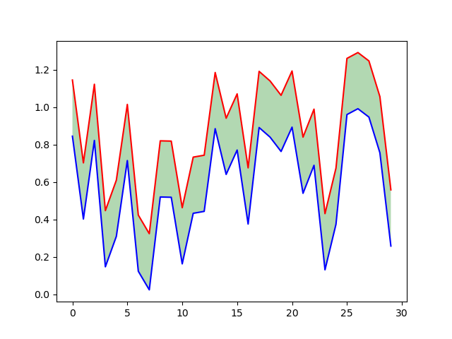

### 1、pandas库

#### 1、读取csv文件

CSV文件中每行相当于一条记录（相当于数据表中的一行），用 “，”（半角逗号）分割每行的不同字段。举例如下：

这是某一个数据集中截取的两行csv

2,13,437,1118846980200,16.467,35.381,6451137.641,1873344.962,14.5,4.9,2,40,0,2,0,0,0,0
2,14,437,1118846980300,16.447,39.381,6451140.329,1873342,14.5,4.9,2,40,0,2,0,0,0,0

**用法**：`pd.read_csv('filepath_or_buffer')`

读取csv或者excel文件为DataFrame格式,DataFrame格式文件见下面

```python
#数据输入的路径：可以是文件路径、可以是URL，也可以是实现read方法的任意对象。也可以是临时文件
import pandas as pd
pd.read_csv("data.csv") #从csv文件来读取
pd.read_csv("http://localhost/data.csv") # 从网址来读取

f = open("data.csv", encoding="utf-8")  
pd.read_csv(f) # 从打开的文件来读取


# 保存成csv文件
pd.to_csv(save_path, index=False)
d.to_csv("./track.csv", index=False, header=True) # 左边的索引就不要了，右边的header任然需要
```

#### 2、pandas里的Series数据类型

线性的数据结构, series是一个一维数组

Pandas 会默然用0到n-1来作为series的index, 但也可以自己指定index( 可以把index理解为dict里面的key )

```python
# 1、创造一个series 
import pandas as pd
import numpy as np
s = pd.Series([9, 'zheng', 'beijing', 128])
print(s)
>>>
0          9
1      zheng
2    beijing
3        128
dtype: object
    
    
    
# 2、自己指定index
import pandas as pd
import numpy as np
s = pd.Series([9, 'zheng', 'beijing', 128, 'usa', 990], index=[1,2,3,'e','f','g'])
print(s)
1          9
2      zheng
3    beijing
e        128
f        usa
g        990
dtype: object
    
    
# 3、根据索引查找值(行的索引)
print(s['f'])  # usa
print(type(s['f']))  # <class 'str'>


# 4、series.value方法
s = pd.Series([9, 'zheng', 'beijing', 128])
print(s)
# print(type(s))  # <class 'pandas.core.series.Series'>
print(s.values)
print(type(s.values))


>>>该方法将其变成一个numpy一维数组，这个与下面的DataFrame相对应
0          9
1      zheng
2    beijing
3        128
dtype: object 
    
[9 'zheng' 'beijing' 128] # 将里面每一个元素都变成numpy数组里面的某一个值
<class 'numpy.ndarray'>
```


#### 3、DataFrame

DataFrame是一种表格型数据结构，它含有一组有序的列，每列可以是不同的值。DataFrame既有行索引，也有列索引，它可以看作是由Series组成的字典，不过这些Series公用一个索引。
DataFrame的创建有多种方式，不过最重要的还是根据dict进行创建，以及读取csv或者txt文件来创建。这里主要介绍这两种方式

```python
pd.read_csv(filepath_or_buffer, sep=',', delimiter=None, header='infer', names=None, index_col=None, usecols=None, squeeze=False, prefix=None, mangle_dupe_cols=True, dtype=None, ...)
```

- filepath_or_buffer:（这是唯一一个必须有的参数，其它都是按需求选用的） 文件所在处的路径
- sep： 指定分隔符，默认为逗号’,’
- delimiter : str, default None
  定界符，备选分隔符（如果指定该参数，则sep参数失效）
- header：int or list of ints, default ‘infer’
  指定哪一行作为表头。默认设置为0（即第一行作为表头），如果没有表头的话，要修改参数，设置header=None,从文件中读取，表头就是列索引
- names：指定列的名称，用列表表示。一般我们没有表头，即header=None时，这个用来添加列名就很有用啦！
- index_col:指定哪一列数据作为行索引，可以是一列，也可以多列。多列的话，会看到一个分层索引
- prefix:给列名添加前缀。如prefix=“x”,会出来"x1"、“x2”、“x3”
- nrows : int, default None
  需要读取的行数（从文件头开始算起）
- DataFrame里面保存的数据类型也可以是字符串

```python
# 1、创建DataFrame与保存成csv文件
import numpy as np
import pandas as pd
test_array = np.arange(16).reshape(4,4)
test1 = pd.DataFrame(test_array,index=['One','Two','Three',"Four"],columns=['a','b','c','d'])
print(test1)

>>>-----------------------------------
#         a   b   c   d
# One     0   1   2   3
# Two     4   5   6   7
# Three   8   9  10  11
# Four   12  13  14  15

# 读取csv文件
df = pd.read_csv('csv_data_path') 

# 保存成.csv文件
one_car_csv_file = pd.DataFrame(all_data) # all_data是一个numpy的数据类型
one_car_csv_file.to_csv("./提取的数据/veh_530.csv", sep=',', index=False, header=False)
# header=False表示不保存csv文件上面那一行数据
# index=False表示最左边不加索引
# 先从numpy创建DataFrame,创建完成之后再保存成.csv格式的文件


# 2、取出DataFrame的一行或者一列      
print(test1['b']) # 根据列索引输出一列
print(test1.loc["One"]) # 根据行索引输出一行
# print(type(test1['b']))#<class 'pandas.core.series.Series'>
>>>-----------------------------------
# One       1
# Two       5
# Three     9
# Four     13
# Name: b, dtype: int32

# a    0
# b    1
# c    2
# d    3
# Name: One, dtype: int32
        
        
# 3、输出多列与输出多行
print(test1[['b','c']])#输出多列,注意里面两个[[]]
print(type(test1[['b','c']]))# <class 'pandas.core.frame.DataFrame'>数据类型并没有发生变化
>>>-----------------------------------
#         b   c
# One     1   2
# Two     5   6
# Three   9  10
# Four   13  14

print(test1.loc[["One","Two"]])#输出多行
---------------------------------------
#      a  b  c  d
# One  0  1  2  3
# Two  4  5  6  7


# 4、判断某列或者某行
print(type(test1['a']==4))#<class 'pandas.core.series.Series'>
print(test1['a']==4)
>>>-----------------------------------
# One      False
# Two       True
# Three    False
# Four     False
# Name: a, dtype: bool


# 5、增加一列数据或者一行数据
# 1.1 增加一列数据
new_list = [1, 2, 3, 4]
test1['e']=new_list
print(test1)
>>>-----------------------------------
#         a   b   c   d  e
# One     0   1   2   3  1
# Two     4   5   6   7  2
# Three   8   9  10  11  3
# Four   12  13  14  15  4
# 1.2 在指定位置插入一列数据
df = pd.DataFrame({'col1': [1, 2], 'col2': [3, 4]})
'''
    col1  col2
0     1     3
1     2     4
'''
df.insert(1, "newcol", [99, 99])
#        col1  newcol  col2
#         0     1      99     3
#         1     2      99     4

# 增加一行数据
test1.loc['Five']=[4,7,8,9,10]
print(test1)
>>>-----------------------------------
#         a   b   c   d   e
# One     0   1   2   3   1
# Two     4   5   6   7   2
# Three   8   9  10  11   3
# Four   12  13  14  15   4
# Five    4   7   8   9  10


# 6、根据条件索引(与上面分开)
test_array = np.arange(16).reshape(4,4)
test1 = pd.DataFrame(test_array,index=['One','Two','Three',"Four"],columns=['a','b','c','d'])
print(test1)

# >>>-----------------------------------
#         a   b   c   d
# One     0   1   2   3
# Two     4   5   6   7
# Three   8   9  10  11
# Four   12  13  14  15

print(test1[test1['a']==4][['b','c','d']]) # 找到a为4的那一列的b,c,d的位置
# >>>-----------------------------------
#      b  c  d
# Two  5  6  7

# 按照两个条件索引的话就是
raw_hist = traj[(traj['frame_id'] >= start_frm_id)
                        & (traj['frame_id'] <= cur_frm_id)][['x', 'y', 'vx', 'vy']]
# 中间加上一个&表示同时满足两个条件


# 7、从字典构造DataFrame
import pandas as pd
d={'one':{'a':1,'b':2,'c':3},'two':{'a':4,'b':5,'c':6},'three':{'a':7,'b':8,'c':9}}
df=pd.DataFrame(d)
print(df)
>>>-----------------------------------
#字典嵌套字典，最外层的字典为行，里层的字典为列
#    one  two  three
# a    1    4      7
# b    2    5      8
# c    3    6      9


# 8、values性质
# 单列情况
print(test1)
print(test1['a'].values)#把那一列的数据以numpy的n维数组的性质来组织
print(type(test1['a'].values))#<class 'numpy.ndarray'>
>>>-----------------------------------
#         a   b   c   d
# One     0   1   2   3
# Two     4   5   6   7
# Three   8   9  10  11
# Four   12  13  14  15
# Five    4   7   8   9
>>>-------------------
# [ 0  4  8 12  4]
>>>-------------------
# <class 'numpy.ndarray'>

# 整体情况
print(test1)
print(test1.values) #对于DataFrame,values的作用就是将其变成一个numpy的二维数组,二维数组的里层元素为每一行的数据
#不过对于dataframe这种数据类型来说，他也只能变成二维的数据类型

    a   b   c   d
0   0   1   2   3
1   4   5   6   7
2   8   9  10  11
3  12  13  14  15
-------------------
[[ 0  1  2  3]
 [ 4  5  6  7]
 [ 8  9 10 11]
 [12 13 14 15]]


# 9、dataframe.head(n)，通常用于打印出来判断dataframe的数据形式对不对
import numpy as np
import pandas as pd
test_array = np.arange(16).reshape(4,4)
test1 = pd.DataFrame(test_array,index=['One','Two','Three',"Four"],columns=['a','b','c','d'])

print(test1.head(3))  # 取出一个dataframe前三行数据
'''
       a  b   c   d
One    0  1   2   3
Two    4  5   6   7
Three  8  9  10  11
'''

# 10、获取DataFrame的列表头
print(test1.columns)
# Index(['a', 'b', 'c', 'd'], dtype='object')
```

#### 4、dataframe数据进行排序

```python
import pandas as pd
data = pd.read_csv("dataset.csv")  # 从csv文件来读取
data=data.sort_values("track_id",ascending=True)  # 进行排序 track_id是列索引
dataset = dataset.sort_values(by=['track_id', 'frame_id'], axis=0, ascending=[True, True]) #也可能用这一个
```


#### 5、读取json文件

```python
import pandas as pd
track=pd.read_json('路径')
print(type(track)) # <class 'pandas.core.frame.DataFrame'>  也是读取成DataFrame类型的数据格式
# 注意最终字典的键是作为列索引
```

注意一般能够读取的数据类型如下图所示

test.json文件

```json
{
    "name": [123,"wangming"],
    "id":[456,"wangjun"],
    "hobby": [789,"wangjian"]
}
```


#### 6、pandas中的数学运算

```python
import  numpy as np
import pandas as pd
df = pd.read_json('./test.json')
print(df) # 输出dataframe类型的数据类型
'''
   A  B  C  D
0  1  2  4  9
1  3  6  7  5
2  6  2  3  6
3  7  3  2  9
'''

# 1、Series.diff() 相减
a=df[['A', 'B']].diff()
print(a)
# 每一个Series数据的和一项减去前一项，由于第0项前面没有任何的数据类型，所以为NaN
# 返回的还是两列数据
'''
     A    B
0  NaN  NaN
1  2.0  4.0
2  3.0 -4.0
3  1.0  1.0
'''

# 2、Series.pow(2) 开次方
b=a.pow(2) # 每一个的数据类型都是平方
print(b) # 这是一个两列的数据类型
'''
     A     B
0  NaN   NaN
1  4.0  16.0
2  9.0  16.0
3  1.0   1.0
'''

# 3、Series.sum()
# 注意这里的axis只能为0或者为1

c=b.sum(axis=1) # 这里1代表是每一行相加
print(c)
'''
0     0.0
1    20.0
2    25.0
3     2.0
dtype: float64
'''

d=b.sum(axis=0) # 这里的0代表每一列相加
print(d)
'''
A    14.0
B    33.0
dtype: float64
'''

# 3、开根号，开根号用到的是numpy库来进行运算
d=np.sqrt(c)
print(np.sqrt(c))
print(type(np.sqrt(c))) # <class 'pandas.core.series.Series'>
'''
0    0.000000
1    4.472136
2    5.000000
3    1.414214
dtype: float64
'''

# 4、累计求和Series.cumsum()
print(d.cumsum())
'''
0     0.000000
1     4.472136
2     9.472136
3    10.886350
dtype: float64
'''
# 可以看出，相比于前面，这里返回了累计和

```


### 2、numpy

最基本用法

```python
# 输出最基本输入类型
a = np.array([1,2,3])
print(a.dtype) # int32
```


#### 0、创建等一些事情

```python
a=np.array([1,5,8,9,10])# <class 'numpy.ndarray'>
print(np.max(a))# 10 输出数组中最大的那个数
print(type(np.max(a)))#<class 'numpy.int32'>
print(np.min(a))# 10 输出数组中最大的那个数

# 数组里面也可以为其他的数据类型，比如字符串数据类型

a=np.arange(10).reshape(2,5)


a=np.max(7) # 经过numpy运算后其就变成了numpy类型的东西
print(a)
print(type(a)) # <class 'numpy.int32'>


# 3、改变数据形式
b=np.array([1,2,3])
b = b.astype(float)
# 经过这里之后里面的数据形式就变成float类型的数据了
```

numpy的切片

```python
a=np.array([1,5,8,9,10])
print(a[1:])  # 左开右闭，从下标1开始，舍弃第一个数据 [5 8 9 10]
print(a[:-1]) # 舍弃最后一个数据，舍弃最后一个数据    [1 5 8 9]
```


np.array()与np.asarray()的区别

相同点：array和asarray都可以将数组转化为ndarray对象。区别：当参数为一般数组时，两个函数结果相同；当参数本身就是ndarray类型时，array会新建一个ndarray对象，作为参数的副本，但是asarray不会新建，而是与参数共享同一个内存。重点就是这个共享内存。

```python
numpy.array(object, dtype=None, copy=True, order='K', subok=False, ndmin=0)
numpy.asarray(object, dtype = None, order = None)
# order有C和F两个选项，分别代表行优先和列优先，在计算机内存中存储元素的顺序

#1、 当输入的object为普通迭代序列时,在这个里面为列表
import numpy as np
 
data = [1,1,1]
print(type(data)) #<class 'list'> 列表类型
arr_ar = np.array(data)
arr_as = np.asarray(data)
 
#输出上没有区别
print(arr_ar) #[1 1 1]
print(arr_as) #[1 1 1]
 
data[1]=2
#改变原序列对arr_ar和arr_as没影响
print(arr_ar) #[1 1 1]
print(arr_as) #[1 1 1]
 
#此时data是[1, 2, 1]
#改变arr_ar和arr_as对原序列没有影响
arr_ar[1]=3
print(data) #[1, 2, 1]
arr_as[1]=3
print(data)  #[1, 2, 1]


# 2、当object对象是ndarray对象时
import numpy as np
 
data = np.ones((3,))
#print(type(data)) #<class 'numpy.ndarray'> 数组类型
arr_ar = np.array(data)
arr_as = np.asarray(data)
 
print(arr_ar) #[1. 1. 1.]
print(arr_as) #[1. 1. 1.]
 
"""
这边区别就出来了。修改原始序列后，
np.array()产生的数组不变，
但是np.asarray()产生的数组发生了变化
"""
data[1]=2
print(arr_ar) #[1. 1. 1.]
print(arr_as) #[1. 2. 1.]  !!!
 
 
"""
这边也有区别，修改array产生的数组，不影响原始序列
修改asarray产生的数组，会影响原始序列
"""
#此时data=[1. 2. 1.]
arr_ar[2]=3
print(data)  #[1. 2. 1.]
arr_as[2]=3
print(data)  #[1. 2. 3.]
```

```python
import numpy as np

a = np.array([1,2,3])
print(a.dtype) # int32
b=np.array(a)
c=np.asarray(a)
a[1]=8 # 我们将原数列给改变了
print(a) # [1 8 3]
# np.array是直接从a赋值过来了
print(b) # [1 2 3]
# 这个相当于是指向a的指针，所以a变化，他也会跟着发生变化
print(c) # [1 8 3]

```

#### 1、取出数组中一行

```python
import numpy as np

Q=np.zeros((5,3))
print(Q)
Q_list=Q[3,:]#前面取出一列
print(Q_list)
>>>
[[0. 0. 0.]
 [0. 0. 0.]
 [0. 0. 0.]
 [0. 0. 0.]
 [0. 0. 0.]]
[0. 0. 0.]
```

#### 2、numpy.random.choice()随机抽样

numpy.random.choice(a, size=None, replace=True, p=None)

- 从a(只要是ndarray都可以，但必须是一维的)中随机抽取数字，并组成指定大小(size)的数组
- replace:True表示可以取相同数字，False表示不可以取相同数字
- 数组p：与数组a相对应，表示取数组a中每个元素的概率，默认为选取每个元素的概率相同。

```python
from numpy.random import choice
samples=choice(["R","G","B"],size=5,p=[0.2,0.5,0.3])#从RGB中随机抽样100次,p代表概率
print(samples)

>>>
['G' 'G' 'B' 'G' 'G']


np.random.choice(5)#从[0, 5)中随机输出一个随机数
#相当于np.random.randint(0, 5)
>>>4#这个输出是int类型


c=np.random.choice(5, 3)#在[0, 5)内输出五个数字并组成一维数组（ndarray）
print(c)
print(type(c))
>>>[2 3 3]
>>><class 'numpy.ndarray'>   #输出的类型还是ndarray

#从下面可以看出，也可以直接传入一个torch类型的张量
#事实上，还可以出入列表，元祖等
import numpy as np
import torch
x=torch.Tensor([1,2,3])
print(x)
action = np.random.choice(x)#x必须是一个一维的张量，否则会报错
print(action)
```


#### 3、np.random.uniform()

np.random.uniform(low=0.0, high=1.0, size=None)

功能：从一个均匀分布[low,high)中随机采样，注意定义域是左闭右开，即包含low，不包含high.
参数介绍:
low: 采样下界，float类型，默认值为0；
high: 采样上界，float类型，默认值为1；
size: 输出样本数目，为int或元组(tuple)类型，例如，size=(m,n,k), 则输出mnk个样本，缺省时输出1个值。
返回值：ndarray类型，其形状和参数size中描述一致。

```python
np.random.seed(i) # numpy的随机数种子

import numpy as np
x=np.random.uniform(0,1,5)
print(x)

>>>[0.4980944  0.31104588 0.02206473 0.67131052 0.01842748]

```

#### 4、np.arange()

```python
np.arange()函数返回一个有终点和起点的固定步长的排列，如[1,2,3,4,5]，起点是1，终点是5，步长为1。
参数个数情况： np.arange()函数分为一个参数，两个参数，三个参数三种情况
1）一个参数时，参数值为终点，起点取默认值0，步长取默认值1。
2）两个参数时，第一个参数为起点，第二个参数为终点，步长取默认值1。
3）三个参数时，第一个参数为起点，第二个参数为终点，第三个参数为步长。其中步长支持小数。
返回的数据类型还是
<class 'numpy.ndarray'>

#一个参数 默认起点0，步长为1 输出：[0 1 2]
a = np.arange(3)

#两个参数 默认步长为1 输出[3 4 5 6 7 8]
a = np.arange(3,9)

#三个参数 起点为0，终点为4，步长为0.1 输出[ 0.   0.1  0.2  0.3  0.4  0.5  0.6  0.7  0.8  0.9  1.   1.1  1.2  1.3  1.4 1.5  1.6  1.7  1.8  1.9  2.   2.1  2.2  2.3  2.4  2.5  2.6  2.7  2.8  2.9]
a = np.arange(0, 3, 0.1)


```

数据类型的问题

```python
print(np.arange(2))
<class 'numpy.ndarray'>
```

#### 5、np.nonzero(a)

```python
a=np.array([1,0,5,8,9,10])
b=np.nonzero(a)#(array([0, 2, 3, 4, 5], dtype=int64),)
# np.nonzero函数是numpy中用于得到数组array中非零元素的位置（数组索引）的函数
print(b[0])# [0 2 3 4 5]
# 注意b[0]才是得到索引的数组
```

#### 6、np创建数组

```python
# 像这种里面有确定参数的，一般传入的列表或者元祖都是指定其维度的

#1、np.zeros()
b=np.zeros([3,2,2]) #创建一个3x2x2的numpy数组，元素全为0
print(b)            #直接用列表指定维度

[[[0. 0.]
  [0. 0.]]

 [[0. 0.]
  [0. 0.]]

 [[0. 0.]
  [0. 0.]]]

a = np.zeros([8, 31, 2])# 用列表来指定其维度
b = np.zeros((8, 31, 2))# 用元祖来指定其维度
print(a.shape)#(8, 31, 2)
print(a.shape)#(8, 31, 2) 列表和元祖指定其维度最后得到结果都是一样的

a=np.zeros((1000,4))
print(a.shape)#(1000, 4)
# 里面直接输入一个元祖也是可以的

#2、numpy.eye() 对角矩阵
b=np.eye(3,4) # 创造一个3x4的numpy数组,注意这里和前面不一样
print(b)      # 用数字来指定维度
>>>
[[1. 0. 0. 0.]
 [0. 1. 0. 0.]
 [0. 0. 1. 0.]]

print(np.eye(3)) # 第二种方法，直接输入一个数字表示一个对角矩阵
[[1. 0. 0.]
 [0. 1. 0.]
 [0. 0. 1.]]

#3、np.empty()
a=np.empty((0,2)) # 和前面一样，可以从元祖来指定维度，也可以从列表来指定维度
b=np.empty([0,2])
print(a) # []
print(b) # []
print(a.shape) # (0, 2)
print(b.shape) # (0, 2)

a=np.empty([3,2])
print(a)
# [[1.0970073e-311 1.0970073e-311]
#  [1.0970073e-311 1.0970073e-311]
#  [1.0970073e-311 1.0970073e-311]]


# 4、np.ones() # 创建一个里面填充全为0的数组
a = np.ones((5,4))
print(a)
# [[1. 1. 1. 1.]
#  [1. 1. 1. 1.]
#  [1. 1. 1. 1.]
#  [1. 1. 1. 1.]
#  [1. 1. 1. 1.]]


#np三个创建三个都不一样

# 4、np.zeros_like(x)
a = np.zeros_like(x)
# 返回一个与x同样维度的矩阵但是矩阵里面全为0
```


#### 7、len(ndarry)

返回ndarry最外层的长度

```python
b=np.zeros([3,2,2])
print(b)
print(len(b)) # 返回的是ndarray的最外层的数据
---------------------------------------------
[[[0. 0.]
  [0. 0.]]

 [[0. 0.]
  [0. 0.]]

 [[0. 0.]
  [0. 0.]]]
3
```

#### 8、numpy.reshape()

```python
将array的维度变为m 行 n列
a=np.arange(10).reshape(2,5)
#np.arange(10)是[0 1 2 3 4 5 6 7 8 9]
>>>
[[0 1 2 3 4]
 [5 6 7 8 9]]
```

#### 9、numpy.shape与numpy.size

numpy.shape以元祖的形式得到当前数组的形状

numpy.size以int数字得到当前数组的个数

```python
a = np.zeros([8, 31, 2])#创造一个8x31x2的numpy数组
print(a.shape)#(8, 31, 2)
print(type(a.shape))#<class 'tuple'>
print(a.size)#496 输出元素的个数
print(type(a.size))# <class 'int'>
```

#### 10、numpy的随机数

```python
np.random.seed(1)#设定随机数种子
L1 = np.random.randn(3, 3)
L2 = np.random.randn(3, 3)
print(L1)
print(L2)

#--------------------------两个结果不一样
[[ 1.62434536 -0.61175641 -0.52817175]
 [-1.07296862  0.86540763 -2.3015387 ]
 [ 1.74481176 -0.7612069   0.3190391 ]]
[[-0.24937038  1.46210794 -2.06014071]
 [-0.3224172  -0.38405435  1.13376944]
 [-1.09989127 -0.17242821 -0.87785842]]


np.random.seed(1)
L1 = np.random.randn(3, 3)
np.random.seed(1)
L2 = np.random.randn(3, 3)
print(L1)
print(L2)
#-------------------------两个结果是一样的
[[ 1.62434536 -0.61175641 -0.52817175]
 [-1.07296862  0.86540763 -2.3015387 ]
 [ 1.74481176 -0.7612069   0.3190391 ]]
[[ 1.62434536 -0.61175641 -0.52817175]
 [-1.07296862  0.86540763 -2.3015387 ]
 [ 1.74481176 -0.7612069   0.3190391 ]]


np.random.uniform(0.,1000,25)  # 25个从0到1000范围内的数据
```

#### 11、np.linspace()

- start：scalar
  起始点
- stop：scalar
  终止点
- num : int, optional
  Number of samples to generate. Default is 50. Must be non-negative.
  默认50，生成start和stop之间50个等差间隔的元素
- endpoint : bool, optional
  If True, stop is the last sample. Otherwise, it is not included. Default is True.
  生成等差间隔的元素，但是不包含stop，即间隔为 （stop - start）/num
- retstep : bool, optional
  If True, return (samples, step), where step is the spacing between samples.
  返回一个（array，num）元组，array是结果数组，num是间隔大小
- dtype : dtype, optional
  The type of the output array. If dtype is not given, infer the data type from the other input arguments.
  输出数组的类型。如果没有给出dtype，则从其他输入参数推断数据类型。

```python
def linspace(start, stop, num=50, endpoint=True, retstep=False, dtype=None)
```

```python
print(np.linspace(0, 1, 5))
# [0.   0.25 0.5  0.75 1.  ]
# 默认是首和尾都有，在首和尾之间找到5个数字
```


#### 12、numpy数学

一、基本数学

1、np.linalg.norm()

矩阵整体元素平方和开根号(最终返回的就是一个数字)

```python
# apply one
a=np.array([3,4])  # [3 4]
print(a)  #[3 4]
b=np.linalg.norm(a)
print(b) # 5.0

# apply two
a = torch.tensor([[1.0, 2.0],
                  [3.0, 4.0],
                  [5.0, 9.0]])
b = np.linalg.norm(a, axis=-1)  # -1表示最后一个维度
print(b.shape)
print(b)

'''
(3,)
[ 2.236068  5.       10.29563 ]
'''
```

1.1 np.linalg.solve


2、np.diff()减法

```python
m = np.array([1,3,10])
n = np.diff(m)
print(n)
# [2 7] 后一个元素减去前一个元素最终形成的数组 维度会少一个
```

3、次方与开方

```python
a=np.array([1,4,5,6,9])
print(a**2)
# [ 1 16 25 36 81]

print(a**0.5)# 这个技术开根号的操作

a=np.array([2,4])
print(np.sqrt(a))
# [1.41421356 2.        ]
```

4、加法

```python
# 1、numpy数组与普通数相加
a=np.array([1,4,5,6,9])
print(a+1)
# [ 2  5  6  7 10]

# 2、numpy数组与数组相加
print(a+a)
# [ 2  8 10 12 18]

# 3、数组中前后元素的累加
a=np.array([1,4,5,6,9]) # 也就是求得从开始到当前这个数的累计数是多少
print(np.cumsum(a)) # [ 1  5 10 16 25]
```

5、三角函数

```python
print(np.arctan2(1,1))  # 一个输入的是两个
print(np.arctan(1))     # 一个输

入的是一个

# 0.7853981633974483  pi/4=0.7853
# 0.7853981633974483

np.deg2rad(-40.) # 角度转换成弧度的函数

```

6、正无穷与负无穷

```python
a=np.inf
b=np.inf
print(a) # inf
```

7、对数相关

```python
import numpy as np
a = np.log10(100)
print(a) # 2.0
```

8、取余数

```python
# 1、对单个数去取余数
import numpy as np
num1 = 6
num2 = 4
out = np.mod(6,4)
print(out) # 2

# 2、对数组整体进行取余
arr1 = np.array([2, -4, 7])
arr2 = np.array([2,  3, 4])
out = np.mod(arr1, arr2)
print(out) # [0,2,3]
```

9、求解欧几里得范数

```python
np.hypot(dx,dy)：计算以dx，dy为直角边的三角形的斜边长度
```

10、np.linalg.norm()也是求解线性代数范数


11、np.sign()取得符号

数字前面的正负号

分别用正号、负号、0来表示数字前面的正负号

```python
a = torch.tensor([1.0, -2.0, 3.0, 0.0, 8.0, -.0])
print(np.sign(a))
# tensor([ 1., -1.,  1.,  0.,  1.,  0.])
```


二、矩阵相关

1、np.diag()

```python
# 返回一个对角矩阵
Q = np.diag([5,6])
print(type(Q))  # <class 'numpy.ndarray'>
print(Q)
# [[5 0]
# [0 6]]
```

2、np.linalg.norm()求范数

linalg = linear+algebra  norm 表示范数

**函数参数如下:**

```python
x_norm=np.linalg.norm(x, ord=None, axis=None, keepdims=False)
# x:表示矩阵(也可以是一维)
# ord表示范数类型 默认就是二范数
# axis=1表示按行向量处理，求多个行向量的范数 
# axis=0表示按列向量处理，求多个列向量的范数
# axis=None表示矩阵范数。
# keepdims是否保持矩阵的二维特性，与False相反
```

**代码举例**

```python
import numpy as np

x = np.array([
    [0, 3, 4],
    [1, 6, 4]])
# 默认参数ord=None，axis=None，keepdims=False
print("默认参数(矩阵整体元素平方和开根号，不保留矩阵二维特性)：", np.linalg.norm(x))
# 8.831760866327848
print("矩阵整体元素平方和开根号，保留矩阵二维特性：", np.linalg.norm(x, keepdims=True))
# [[8.83176087]]
print("矩阵每个行向量求向量的2范数：", np.linalg.norm(x, axis=1, keepdims=True))
# [[5.        ]
#  [7.28010989]]
# 如果没有加上keepdims=True的话,最后的结果直接是[5.         7.28010989],没有保留二维特性,直接输出了一维数据
print("矩阵每个列向量求向量的2范数：", np.linalg.norm(x, axis=0, keepdims=True))
# [[1.         6.70820393 5.65685425]]
print("矩阵1范数：", np.linalg.norm(x, ord=1, keepdims=True))
# [[9.]]
print("矩阵2范数：", np.linalg.norm(x, ord=2, keepdims=True))
# [[8.70457079]]
print("矩阵∞范数：", np.linalg.norm(x, ord=np.inf, keepdims=True))
# [[11.]]
print("矩阵每个行向量求向量的1范数：", np.linalg.norm(x, ord=1, axis=1, keepdims=True))
# [[ 7.]
#  [11.]]

```


三、相关快捷操作

1、np.ceil与np.floor的用法

计算大于等于该值的最小整数

```python
>>> a = np.array([-1.7, -1.5, -0.2, 0.2, 1.5, 1.7, 2.0])
>>> np.ceil(a)
array([-1., -1., -0.,  1.,  2.,  2.,  2.])


# 2、np.floor()
np.floor(a) # 这个是向下面取整数
```

2、np.sign()函数

取数字前的正负号。正数返回1,  0返回0,  负数返回-1

```python
a = np.array([-1, -2, 0, 5, 9])
print(np.sign(a)) # [-1 -1  0  1  1]
```

#### 13、np.argmin(d)与np.argwhere

输出一些位置的索引

1、argmin()

这个函数用来返回最小点的索引

```python
a=np.array([1,3,7,-9,10])
print(np.argmin(a)) # 3 返回最小点的索引
```

2、argwhere()

```python
a = np.array([1, 2, 3, 3, 0, 2, 3, 1])
c = (a == 2)  # [False  True False False False  True False False]
print(np.argwhere(c))  # 输出不为0位置的索引
# [[1]
#  [5]]
```


#### 14、np.squeeze()

numpy.squeeze(a,[axis] = None)

 1）a表示输入的数组；
 2）axis用于指定需要删除的维度，但是指定的维度必须为单维度，否则将会报错；
 3）axis的取值可为None 或 int 或 tuple of ints, 可选。若axis为空，则删除所有单维度的条目；
 4）返回值：数组             

 5)不会修改原数组

np.squeeze（）函数可以删除数组形状中的单[维度]条目，即把shape中为1的维度去掉，但是对非单维的维度不起作用

```python
a= np.arange(10).reshape(1,2,5)
print(a.shape)  # (1, 2, 5)
a=np.squeeze(a)
print(a.shape)  # (2, 5)
```

#### 15、np.c_ 与 np.r_

np.c_是按行连接两个矩阵，就是把两矩阵左右相加，要求行数相等。

```python
a = np.array([[1, 2, 3],[7, 8, 9]])
b = np.array([[4, 5, 6],[1, 2, 3]])
c=np.c_[a,b]
print(c)
# [[1 2 3 4 5 6]
#  [7 8 9 1 2 3]]
```

np.r_是按列连接两个矩阵，就是把两矩阵上下相加，要求列数相等。

```python
d=np.r_[a,b]
print(d)
#[[1 2 3]
# [7 8 9]
# [4 5 6]
# [1 2 3]]
```


#### 16、np.asfortranarray()

```python
np.asfortranarray(np.zeros(3, dtype=np.float64)) # 返回内存中按照Fortan顺序排列的数组
```

#### 17、np.dot()

```python
# case1:都为一维向量的情况下
import numpy as np
a = np.array([1, 2, 3])
b = np.array([6, 7, 8])
print(np.dot(a, b)) # 44 都为一维向量的情况下输出的是两个向量相乘之间的内积

# case2:都为矩阵的情况下
# 等价为矩阵的乘法 如果不满足矩阵乘法维度的要求就有可能会报错
import numpy as np
x = np.array([[1, 2, 3],[3, 4, 4]])
y = np.array([[0, 1, 1, 1],[1, 2, 0, 1],[0, 0, 2, 1]])
result = np.dot(x, y)
print(result)
print("x阶数：" + str(x.shape))
print("y阶数：" + str(y.shape))
print("result阶数：" + str(result.shape))

'''
[[ 2  5  7  6]
 [ 4 11 11 11]]
x阶数：(2, 3)
y阶数：(3, 4)
result阶数：(2, 4)
'''

# case3:矩阵和向量相乘，仍然是矩阵的乘法的意思
import numpy as np
x = np.array([[1, 2, 3],
              [3, 4, 4]])
y = np.array([1, 2, 3])
result = np.dot(x, y)
print(result)
print("x阶数：" + str(x.shape))
print("y阶数：" + str(y.shape))
print("result阶数：" + str(result.shape))
'''
[14 23]
x阶数：(2, 3)
y阶数：(3,)
result阶数：(2,)
'''

import numpy as np
x = np.array([[1, 2, 3],
              [3, 4, 4]])
y = np.array([[1],[2],[3]]) # 两者唯一的区别就在这里，个人觉得这种才是更加正确的方法
result = np.dot(x, y)
print(result)
print("x阶数：" + str(x.shape))
print("y阶数：" + str(y.shape))
print("result阶数：" + str(result.shape))
'''
[[14]
 [23]]
x阶数：(2, 3)
y阶数：(3, 1)
result阶数：(2, 1)
'''
```

#### 18、np.hstack

```python
# 将参数元祖的元素按照水平方向进行叠加
# 第一种情况，都是numpy数组的情况
import numpy as np
arr1 = np.array([[1,3], [2,4] ])
arr2 = np.array([[1,4], [2,6] ])
res = np.hstack((arr1, arr2))
print (res)
#
[[1 3 1 4]
 [2 4 2 6]]

# 第二种情况: 存在列表的情况下
arr1 = [1,2,3]
arr2 = [4,5]
arr3 = [6,7]
res = np.hstack((arr1, arr2,arr3))
print(res) # [1 2 3 4 5 6 7]

```

#### 19、np.concatenate()拼接两个数组

```python
import numpy as np
a=np.arange(6).reshape(2,3)
b=np.arange(6,12).reshape(2,3)
print(a)
# [[0 1 2]
#  [3 4 5]]
print(b)
# [[ 6  7  8]
#  [ 9 10 11]]

# 0为行，1为列，0表示改变行，1表示改变列
# case1:
c1=np.concatenate((a,b),axis=0) # 0表示沿着垂直方向
print(c1)
# [[ 0  1  2]
#  [ 3  4  5]
#  [ 6  7  8]
#  [ 9 10 11]]

# case2:
c2=np.concatenate((a,b),axis=1) # 1表示沿着水平方向
print(c2)
# [[ 0  1  2  6  7  8]
#  [ 3  4  5  9 10 11]]


# case1:用于拼接两个单维度的数组
lane1 = np.random.randint(0, 3, 5)  # [1 0 2 0 2]
lane2 = np.random.randint(0, 2, 3)  # [0 1 0]
lane = np.concatenate((lane1, lane2), axis=0)  # [1 0 2 0 2 0 1 0]
```

#### 20、np.transpose()转换数组的维度

```python
# 函数中输入的元祖其实是代表一个索引量，也即是维度的索引量。原本维度的索引量都是(0,1,...),我们在函数中改变了这个索引量.
import numpy as np
# 0、普通情况之下，就是一个转置
a=np.array([1,2,3,4,5,6]).reshape(2,3)
print(a)
'''
[[1 2 3]
 [4 5 6]]
'''
print(np.transpose(a))
'''
[[1 4]
 [2 5]
 [3 6]]
'''

# 1、二维情况就可以理解为一个转置
a=np.arange(6).reshape(2,3)
print(a)
'''
[[0 1 2]
 [3 4 5]]
'''
print(np.transpose(a,(1,0)))
'''
[[0 3]
 [1 4]
 [2 5]]
'''

# 2、注意多维情况
b=np.arange(24).reshape(2,4,3)
print(b)
'''
[[[ 0  1  2]     # 就比如第二行的这个4,原本是(1,2,2),变换之后变成(2,1,2)
  [ 3  4  5]
  [ 6  7  8]
  [ 9 10 11]]

 [[12 13 14]
  [15 16 17]
  [18 19 20]
  [21 22 23]]]
'''
print(np.transpose(b,(1,0,2))) # 也就是第一个索引(索引0)和第二个索引(索引1)互换位置
# 原本是2x4x3 ,索引0和索引1互换位置之后变成了4x2x3
'''
[[[ 0  1  2]
  [12 13 14]]

 [[ 3  4  5]
  [15 16 17]]

 [[ 6  7  8]
  [18 19 20]]

 [[ 9 10 11]
  [21 22 23]]]
'''
```

#### 21、np.tile()

tile这个英文单词有平铺的意思

```python
a=np.arange(6).reshape(2,3)
print(a)
'''
[[0 1 2]
 [3 4 5]]
'''
print(np.tile(a,2)) # 沿着x轴平铺,不指定默认就是沿着x轴平铺
'''
[[0 1 2 0 1 2]
 [3 4 5 3 4 5]]
'''
print(np.tile(a,(2,3))) # 2控制的纵向，3控制横向
'''
[[0 1 2 0 1 2 0 1 2]
 [3 4 5 3 4 5 3 4 5]
 [0 1 2 0 1 2 0 1 2]
 [3 4 5 3 4 5 3 4 5]]
'''

# 如果先指定了那即是先平铺行，后平铺列，如果没有指定的话直接平铺列
```

#### 22、np.floor()与np.ceil()和numpy.round()

```python
import numpy as np
# 向上取整
print(np.floor(3.14))  # 3.0
# 向下取整
print(np.ceil(3.14))   # 4.0
```

numpy.round()函数的解析如下图所示

**np.around(a, decimals=0, out=None)**

- a: array_like，输入数据；

- decimals: int，指定保留小数点后的位数

- out: ndarray，输出数组，与输入维度一致；

  np.around()函数对输入浮点数执行5舍6入，5做特殊处理（小数点最后一位为5的舍入为与其值最接近的**偶数值**）

```python
# 第一种情况
import numpy as np
print(np.around([1.3, 1.5, 2.5])) # [1. 2. 2.]

# 第二种情况
print(np.around([1.35, 1.57, 2.59]))  # [1. 2. 3.]
# 里面的1表示保留小数点后面一位数字
print(np.around([1.35, 1.57, 2.59],1))  # [1.4 1.6 2.6]
```

#### 24、numpy数据类型转换成python自带数据类型

```python
a = np.array([1, 2, 3])
print(type(a[0])) # <class 'numpy.int32'>
print(type(a[0].item())) # <class 'int'>
```

#### 25、numpy布尔数组的应用

1、用bool来提取特定位置的值

```python
# numpy array == 一个数字  就可以将numpy数组转换成bool类型的数据
# numy array[bool类型的numpy数组] 就可以将numpy对应的为true的地方给提取出来(外面的数组与中括号里面的数组维度要相等)


a = np.array([1, 2, 3, 3, 0, 2, 3, 1])
b = np.arange(8)  # [0 1 2 3 4 5 6 7]
c = (a == 2)  # [False  True False False False  True False False]
# 相当于一个np数组里面套上了另一个np数组
print(b[c])  # [1 5] , 只把为true的地方提取出来
```

2、用bool来替换特定位置的值

```python
a = np.array([1, 2, 3, 3, 0, 2, 3, 1])
b = (a == 2)  # [False  True False False False  True False False]
a[b] = np.array([5,5])
print(a)  # [1 5 3 3 0 5 3 1]
```

#### 26、np.any()与np.all()

1、np.array.any()是**或**操作，任意一个元素为True, 输出就为True

```python
a = np.array([0, 0, 0])
print(a.any())  # False
b = np.array([0, 1, 0])
print(b.any())  # True
```

2、np.array.all()是**和**操作，只有当所有元素都为True的时候才为True

```python
a = np.array([0, 0, 0])
print(a.all())  # False
b = np.array([0, 1, 0])
print(b.all())  # False
c = np.array([1, 2, 3])  # 所有的元素都大于0才为True
print(c.all())  # True
```

#### 27、利用np.all来找到某一个范围内的数组

```python
a = np.arange(30*2).reshape(30,2)
b = a[:, 1]
c = ((b >= 0) & (b <= 30))   # 注意不能用and,用and会报错
print(c)
# [ True  True  True  True  True  True  True  True  True  True  True  True
#   True  True  True False False False False False False False False False
#  False False False False False False]
print(c.all())

```


#### 27、np.isclose()和numpy.allclose

判断两个数组在公差范围内是否足够接近，isclose()可以输出逐个元素的判别结果，而isclose()输出整体元素的判别结果


#### 28、np.sum()

```python
a = np.array([[1, 2, 3], [4, 5, 6]])
print(np.sum(a))  # 21
print(type(np.sum(a)))  # <class 'numpy.int32'>
```

#### 29、numpy中的深拷贝

```python
# 1、浅拷贝
# 共享内存地址的两个变量，当其中一个变量的值改变时，另一个变量的值也随之改变。此时，变量间的“拷贝”是“浅拷贝
a = np.array([-45, -66, 2, 25, 99, -33])
b = a
print(b is a)  # True
print(id(a))  # 1740315186160 类似于C++中的取出地址
print(id(b))  # 1740315186160 类似于C++中的取出地址

a[0] = 6  # a改变b也随之进行改变
print(a)  # [  6 -66   2  25  99 -33]
print(b)  # [  6 -66   2  25  99 -33]

#  共享视图也是浅拷贝
e = np.array([-45, -66, 2, 25, 99, -33])
f = e.view()  # f与e “共享视图”
print(id(e) == id(f))  # False 两个东西不相等
e[0] = 6
print(e)  # [  6 -66   2  25  99 -33]
print(f)  # [  6 -66   2  25  99 -33]


# 2、深拷贝  获得了一个独立的个体
# 深拷贝得到的变量之间互不干扰，其中一个变量值改变的时候并不影响其他值的高边
e = np.array([-45, -66, 2, 25, 99, -33])
g = np.copy(e)
print(g)  # [-45 -66 2 25 99 -33]
e[0] = 0
print(g)  # [-45 -66 2 25 99 -33]
print(f)  # [  6 -66   2  25  99 -33]

# 3、一些应用
# 使用整数序列作为下标获得的数组不和原始数组共享数据空间
x = np.arange(1, 10)
print(x)  # [1 2 3 4 5 6 7 8 9]
y = x[[0, 5, 8]]
print(y)  # [1 6 9]
x[0] = 100
print(y)  # [1 6 9] y的值并没有发生任何改变
```

#### 30、逻辑判断

np.logical_and/or/not  逻辑**与或非**

```python'

```

#### 31、np.around()

```python
np.around(np.arctan2(vy_all, vx_all), decimals=3)  # 进行4舍5入操作
```

#### 32、np.insert()

```python
a = np.array([1, 2])  # 在一个数组的指定位置插入某一个数组 
b = np.insert(a, 0, [0, 0])
c = np.insert(a, 1, [0, 0])
d = np.insert(a, 2, [0, 0])
print(b)  # [0 0 1 2]
print(c)  # [1 0 0 2]
print(d)  # [1 2 0 0]
```

#### 33、np.pad()

```python
```


#### 35、np.repeat()


#### 36、np.clip()

```python
a = np.arange(10)
print(a)  # [0 1 2 3 4 5 6 7 8 9]

# case1:约束条件为单个数字
b = np.clip(a, 3, 6)  # 数组中所有的数被限制在了[3,6]之间
print(b)  # [3 3 3 3 4 5 6 6 6 6]

# case2:约束条件为数组
c = np.clip(a, [3, 3, 3, 4, 5, 6, 7, 8, 9, 10], 8)
print(c) # [3 3 3 4 5 6 7 8 8 8]
```

#### 37、np.append()


#### 

```python
```

#### 38、np.copy()

np数组中的深拷贝与浅拷贝，有一点cpp中的指针

```python
import numpy as np

x = np.array([1, 2, 3])

y = x         # 浅层拷贝，没有获得独立的个体
z = x.copy()  # 深层拷贝，获得了独立的个体
x[0] = 10

print(y)  # [10  2  3]
print(z)  # [1 2 3]
```

#### 39、torch.norm()

求得范数，默认是二范数

```python
import torch

a = torch.ones((2, 3))  # 建立tensor
a2 = torch.norm(a)  # 默认求2范数
a1 = torch.norm(a, p=1)  # 指定求1范数

print(a)
'''
tensor([[1., 1., 1.],
        [1., 1., 1.]])
'''
print(a2)
'''
tensor(2.4495)  具体值为根号6
'''
print(a1)
'''
tensor(6.)
'''
```


### 3、pytorch

#### 0、pytorch中创建变量的基本用法

查看pytorch版本

```python
print(torch.__version__)
print(torch.version.cuda)
```

1、torch.tensor与torch.Tensor

**torch.Tensor()** :是python类，默认张量类型torch.FloatTensor()的别名

**torch.tensor()** :是python的函数，函数原型是torch.tensor(data, dtype=None, device=None, requires_grad=False)

其中data可以是：list, tuple, array, scalar等类型，torch.tensor()可以从data中的数据部分做拷贝（而不是直接引用），根据原始数据类型生成相应的torch.LongTensor，torch.FloatTensor，torch.DoubleTensor。

```python
# 1、torch.tensor()
a=torch.tensor([[1,2,3,4],[5,6,7,8],[9,10,11,12]]) #我们输入一个多维列表，它会自动创建
print(a.type())#torch.LongTensor  张量类型，默认数据类型和下面的是不一样的
print(a.dtype)#torch.int64        张量里面数据类型
print(type(a))#<class 'torch.Tensor'>
print(a.shape)#torch.Size([3, 4]) 张量大小
# tensor([[ 1,  2,  3,  4],
#         [ 5,  6,  7,  8],
#         [ 9, 10, 11, 12]])

# a=torch.tensor(3,4)是会报错的


# 2、torch.Tensor()
print("--------")
b=torch.Tensor(3,4) #通过指定维度来创建
print(b)
# tensor([[       nan,        nan,        nan,        nan],
#         [       nan,        nan, 0.0000e+00, 0.0000e+00],
#         [1.4013e-45, 0.0000e+00, 2.8026e-45, 0.0000e+00]])


c=torch.Tensor([[1,2,3,4],[5,6,7,8],[9,10,11,12]])#也可以直接从原始数据进行创建
print(c)
# tensor([[ 1.,  2.,  3.,  4.],
#         [ 5.,  6.,  7.,  8.],
#         [ 9., 10., 11., 12.]])
print(c.type())#torch.FloatTensor
print(c.dtype)#torch.float32
```

2、几种默认创建方式

基本上包含了pytorch中所有的张量创建方式

```python
# 1、创建未初始化的张量
data=torch.Tensor(3,5)#torch.float32
print(data)
tensor([[1.0469e-38, 9.5510e-39, 8.4489e-39, 9.6429e-39, 8.4490e-39],
        [9.6429e-39, 9.2755e-39, 1.0286e-38, 9.0919e-39, 8.9082e-39],
        [9.2755e-39, 8.4490e-39, 1.0194e-38, 9.0919e-39, 1.4574e-43]])

# 2、构建一个随机初始化的矩阵
# 2.1 rand()
data1=torch.rand(5,3)#torch.float32，返回一个张量，包含了从区间[0, 1)的均匀分布中抽取的一组随机数
print(data1)
tensor([[0.2766, 0.4617, 0.2343],
        [0.3724, 0.3016, 0.2259],
        [0.9351, 0.4583, 0.6723],
        [0.1284, 0.2405, 0.0014],
        [0.6098, 0.6196, 0.3769]])#参数都是0~1之间
random_num = 10 + torch.rand(1) * (20 - 10)  # 创建一个在(10,20)之间的随机数


# 2.2 randn()
#返回一个从均值为0、方差为1的正态分布(也称为标准正态分布)中填充随机数的张量
print(torch.randn(2, 2))
tensor([[-1.3618, -0.7388],
        [-1.7570, -1.1348]])
# 生成一个 3x4 的随机矩阵，均值为 5，方差为 2
random_matrix = 5 + torch.randn(3, 4) * (2 ** 0.5)  # 类似于重参数化技巧

# 2.3 randint()函数
# 返回指定范围和指定形状的张量
torch.randint(low=0, high, size, *, generator=None, out=None, dtype=None, layout=torch.strided, device=None, requires_grad=False)
# 其中，low是下界，high是上界。size为形状
# 返回(5,10)之间，形状为(2,3)的张量
c = torch.randint(5,10,(2,3))
print(c)
# tensor([[8, 5, 6],
#         [7, 9, 6]])


# 3、产生一个全0或全1矩阵
x=torch.zeros(2,3)#torch.float32
print(x)
x=torch.ones(3,2)#torch.float32
print(x)

tensor([[0., 0., 0.],
        [0., 0., 0.]])
tensor([[1., 1.],
        [1., 1.],
        [1., 1.]])


# 3.1 指定形状用不用() 两种方式完全等价
a=torch.zeros((3,4,5),dtype=torch.double) # 这种方式可以指定一些额外属性
print(a.shape)   # torch.Size([3, 4, 5])
b=torch.zeros(3,4,5)
print(a.shape)   # torch.Size([3, 4, 5])


# 4、创建一个按照顺序排列的张量
a=torch.arange(0,24).view(2,3,4)
print(a)

# tensor([[[ 0,  1,  2,  3],
#          [ 4,  5,  6,  7],
#          [ 8,  9, 10, 11]],
#
#         [[12, 13, 14, 15],
#          [16, 17, 18, 19],
#          [20, 21, 22, 23]]])

# 先创建一个一维张量，再通过一维张量来改变维度得到我们想得到的张量

a = torch.arange(0,24,2)
print(a)
# tensor([ 0,  2,  4,  6,  8, 10, 12, 14, 16, 18, 20, 22])
# 上面算式相当于每隔两个就取得一个


# 5、torch.empty()创建一个未被初始化数值的张量
import torch
empty = torch.empty((2, 3))  # Returns a tensor filled with uninitialized data.
print(empty)  # 每一次跑的结果都不一样
# tensor([[3., 2., 1.],
#         [0., 1., 2.]])


# 6、torch.ones_like()和torch.zeros_like() 创建一个与输入矩阵形状相同的全为1的矩阵
a=torch.tensor([[1,2,3],[4,5,6],[7,8,9]])
print(a)
b=torch.ones_like(a)
print(b)
'''
tensor([[1, 2, 3],
        [4, 5, 6],
        [7, 8, 9]])
tensor([[1, 1, 1],
        [1, 1, 1],
        [1, 1, 1]])
'''
a = torch.tensor([[1,2,3,],[4,5,6]])
b = torch.zeros_like(a)

# 7、填充指定值
a = torch.tensor([[1,2,3,],[4,5,6]])  # 返回一个新张量，在张量中填充指定值。
b = torch.fill(a,9)


# 8、线性排列张量
# 8.1 torch.linspace函数
torch.linspace(start, end, steps=100, *, out=None, dtype=None, layout=torch.strided, device=None, requires_grad=False)
# 生成从起始值到结尾值(所有结果都包含)，总个数为steps的张量。
b = torch.linspace(start=1,end=10,steps=20)
# 生成从1开始,10结尾,总个数为20的等差数列(这里的steps实际上为生成的数量)
# 
print(b)
# tensor([ 1.0000,  1.4737,  1.9474,  2.4211,  2.8947,  3.3684,  3.8421,  4.3158,
#          4.7895,  5.2632,  5.7368,  6.2105,  6.6842,  7.1579,  7.6316,  8.1053,
#          8.5789,  9.0526,  9.5263, 10.0000])
# 注意以上结果包含起始值和结尾值

# 8.2 torch.arange函数(此函数为经常使用之最)
torch.arange(start=0, end, step=1, *, out=None, dtype=None, layout=torch.strided, device=None, requires_grad=False)
# 生成从起始到结尾不包含(end)且步长为1的张量
# 此处的step才是真正的step。相邻两个值之间的差距

b = torch.arange(1,10,3)
print(b)
# tensor([1, 4, 7])

c = torch.arange(10)
print(c)
# tensor([0, 1, 2, 3, 4, 5, 6, 7, 8, 9])

```

3、torch.size()与torch.shape

```python
#有两种方式,注意和numpy的区别
x = torch.zeros(3,2,4,1,2,1)# dimension of 3*2*4*1*2
print(x.size())             # torch.Size([3, 2, 4, 1, 2, 1]) #numpy里面的一个方法
print(x.size(1))            # <class 'int'> 输出第1维的维度,输出为2，是从0维开始


print(x.shape)              # torch.Size([3, 2, 4, 1, 2, 1]) #numpy里面的一个属性
print(x.shape[1])           # <class 'int'> 输出第1维的维度,输出为2
# 注意这里不太一样
#可以使用[]索引访问,所以size属性是一个迭代器  

print(x.numel()) #48 <class 'int'>
# 获取张量的元素个数，注意和numpy中的区别
```

4、直接通过一个张量的形状来创建变量

```python
a=torch.tensor([[1,2,3,4],[5,6,7,8],[9,10,11,12]])
b = torch.ones(a.shape)
print(b)
# tensor([[1., 1., 1., 1.],
#         [1., 1., 1., 1.],
#         [1., 1., 1., 1.]])
```


#### 1、torch.max()与.argmax()

```python
import torch

x=torch.Tensor([1,2,3])
print(x.max())#tensor(3.) 输出最大的那个张量
print(x.argmax())#tensor(2) 输出最大那个张量的索引


a=torch.rand((4,5))
print(a)
print(a.max())#返回这个张量中最大的元素
#>>>
'''
tensor([[0.0119, 0.2415, 0.0290, 0.4108, 0.1737],
        [0.3485, 0.9487, 0.2545, 0.4505, 0.6997],
        [0.3159, 0.0297, 0.0502, 0.5763, 0.1943],
        [0.2967, 0.2742, 0.5447, 0.2503, 0.0959]])
tensor(0.9487)
'''

```


```python
a=torch.rand((4,5))
print(a)
print(a.max(dim=1))

#>>>----------------------------
tensor([[0.7136, 0.6893, 0.1398, 0.6857, 0.1085],
        [0.6104, 0.5863, 0.2358, 0.3667, 0.2073],
        [0.1490, 0.2517, 0.1344, 0.8968, 0.5082],
        [0.8090, 0.8759, 0.7021, 0.3474, 0.5261]])

torch.return_types.max(values=tensor([0.7136, 0.6104, 0.8968, 0.8759]),
indices=tensor([0, 0, 3, 1]))

# 返回两个张量，一个最大值的张量一个索引的张量
# 索引是从0开始的
```

#### 2、改变维度 torch.unsqueeze与torch.squeeze与tensor.view

注意：改变张量的维度顺序和张量的形状是不一样的


1、unsqueeze对一个张量进行维度扩充，0为行方向扩充，1为列方向扩充，对于一维张量可以这么理解

```python
# 1、对于1维张量的情况
#0可以理解为在最外层加上一个维度，也就是第一维前面
#1可以理解为在里面每一个元素再加上一个元素，最后一维
a = torch.tensor([1,2,3,4])
b = torch.unsqueeze(a,0)
c=torch.unsqueeze(a,1)
print(a)
print(b)
print(c)

>>>
tensor([1, 2, 3, 4])
tensor([[1, 2, 3, 4]])
tensor([[1],
        [2],
        [3],
        [4]])


# 2、针对多维的情况
x = torch.zeros(3,2,4,1,2,1)
a=torch.unsqueeze(x,1)#在原先2的位置加上一个维度，2往里面移动
print(a.shape)#torch.Size([3, 1, 2, 4, 1, 2, 1])


# 应用例子
a=torch.tensor([[1,2,3],[4,5,6],[7,8,9]])
print(a)
# tensor([[1, 2, 3],
#         [4, 5, 6],
#         [7, 8, 9]])
a = a.unsqueeze(dim=2)  # 为3的话就报错了
print(a)
# tensor([[[1],
#          [2],
#          [3]],
#
#         [[4],
#          [5],
#          [6]],
#
#         [[7],
#          [8],
#          [9]]])
a=a.repeat(1,1,3)
print(a)
# tensor([[[1, 1, 1],
#          [2, 2, 2],
#          [3, 3, 3]],
#
#         [[4, 4, 4],
#          [5, 5, 5],
#          [6, 6, 6]],
#
#         [[7, 7, 7],
#          [8, 8, 8],
#          [9, 9, 9]]])


# 关于维度信息
# 维度如下图所示：
a = torch.arange(0,100)
print(a.shape)  # torch.Size([100])
a1 = a.unsqueeze(0)
a2 = a.unsqueeze(1)
print(a1.shape)  # torch.Size([1, 100])
print(a2.shape)  # torch.Size([100, 1])
```

2、torch.squeeze

降维,torch.squeeze(input, dim=None, out=None)

将输入张量形状中的1 去除并返回。 如果输入是形如(A×1×B×1×C×1×D)，那么输出形状就为： (A×B×C×D)

当给定dim时，那么挤压操作只在给定维度上。例如，输入形状为: (A×1×B), `squeeze(input, 0)` 将会保持张量不变，只有用 `squeeze(input, 1)`，形状会变成 (A×B)

返回张量与输入张量共享内存，所以改变其中一个的内容会改变另一个。

- `input (Tensor)` – 输入张量
- `dim (int, optional)` – 如果给定，则input只会在给定维度挤压
- `out (Tensor, optional)` – 输出张量

**多维张量本质上就是一个变换，如果维度是 1 ，那么，1 仅仅起到扩充维度的作用，而没有其他用途，因而，在进行降维操作时，为了加快计算，是可以去掉这些 1 的维度。**

```python
# 1、去掉张量中维度为1的维度。不指定维度的话就会将所有维度为1的都进行压缩
x = torch.zeros(3,2,4,1,2,1)# dimension of 3*2*4*1*2
a=torch.squeeze(x)
print(a.shape)#torch.Size([3, 2, 4, 2])

# 2、指定维度来去除
x = torch.zeros(3,2,4,1,2,1)
a=torch.squeeze(x,3)
print(a.size())#torch.Size([3, 2, 4, 2, 1])
# 去除第3个维度，从0开始计算
print(x.size())
```

3、使用tensor.view()改变维度

torch.reshape()、torch.view()可以调整Tensor的shape，返回一个新shape的Tensor，torch.view()是老版本的实现，torch.reshape()是最新的实现，两者在功能上是一样的。

torch.view()通常用于具有连续内存空间的张量。

torch.reshape()则无所谓。

```python
import torch

a=torch.arange(0,6) # 返回一个一维张量，按照顺序来排列
print(a) #tensor([0, 1, 2, 3, 4, 5])

a=a.view(2,3)
print(a)
# tensor([[0, 1, 2],
#         [3, 4, 5]])
```

4、torch.reshape()

改变张量的形状这个是一个函数，并不是张量本省的方法

```python
inputs =torch.tensor([1,2,3],dtype=torch.float32) #中括号里面指定的是具体的值
targets=torch.tensor([1,2,5],dtype=torch.float32)

#这里不reshape也是可以的
inputs=torch.reshape(inputs,(1,1,1,3))#小括号指定的是维度
targets=torch.reshape(targets,(1,1,1,3))
同样有tensor.reshape()方法
```

关于stride的相关解释

```python

data = torch.arange(12).view(3,4)
print(data)
# tensor([[ 0,  1,  2,  3],
#         [ 4,  5,  6,  7],
#         [ 8,  9, 10, 11]])
print(data.stride())
# (4, 1)
# 4表示从第0行到第一行所跨过的字节数(维度0)
# 1表示从第一列到第二列所跨过的字节数(维度1)


data = torch.arange(12).view(2,2,3)
print(data)
# tensor([[[ 0,  1,  2],
#          [ 3,  4,  5]],

#         [[ 6,  7,  8],
#          [ 9, 10, 11]]])
print(data.stride())
# (6, 3, 1)  # 分别对应维度0、维度1以及维度2
```


```python
# 使张量在内存中变得连续。
tensor.contiguous()
```


-------------------------------------------------------------------------------------------------------------------------------------------------------------------------------------------

分割符。下面都是转变轴维度的。


5、tensor.transpose()

转置和前面的改变维度是不一样的。转置是将	

转换两个维度，只能转换两个维度，转换多个维度可以用torch.permute()

转换之后再内存中是不连续的，后续操作可能会出现问题

```python
import torch
a=torch.arange(0,12).view(3,4)
print(a)
'''
tensor([[ 0,  1,  2,  3],
        [ 4,  5,  6,  7],
        [ 8,  9, 10, 11]])
'''
print(a.transpose(0,1)) # a.transpose(1,0)效果也是一样的
'''
tensor([[ 0,  4,  8],
        [ 1,  5,  9],
        [ 2,  6, 10],
        [ 3,  7, 11]])
'''
```


6、tensor.t()转置操作

比较简单，但是只适用于二维张量

```python
import torch
a=torch.arange(0,12).view(3,4)
print(a)
'''
tensor([[ 0,  1,  2,  3],
        [ 4,  5,  6,  7],
        [ 8,  9, 10, 11]])
'''
print(a.t())
'''
tensor([[ 0,  4,  8],
        [ 1,  5,  9],
        [ 2,  6, 10],
        [ 3,  7, 11]])
'''
```


7、torch.permute(), 转变维度


permute()是将维度互换，比如原来的索引是torch.Size([1, 2, 3])，经过互换之后，permute(2,0,1)，表示将原来的索引为2的维度放在第一个维度，把原来索引为0的维度放在第0个维度，把原来索引为1的维度放在第三个维度。具体怎么样变换可以见上表。

```python
b=torch.Tensor([[[1,2,3],[4,5,6]]])
print(b.size())  #  ——>  torch.Size([1, 2, 3])
permuted=b.permute(2,0,1)
print(permuted.size())     #  ——>  torch.Size([3, 1, 2])
print(permuted)
#输出为：
torch.Size([1, 2, 3])
torch.Size([3, 1, 2])
tensor([[[1, 4]],
        [[2, 5]],
        [[3, 6]]], dtype=torch.int32)
```

8、torch.einsum()函数

爱因斯坦求和约定表达式。

```python 
import torch

# 1.在不同输入之间连续出现的索引表示沿着这一维度进行乘法。
# 2.只出现在输入中的索引表示在这一索引上进行求和。
# 矩阵乘法
torch.einsum("ik,kj->ij",A,B)

a = torch.arange(6).view(2,3)
b = torch.arange(6).view(3,2)
res = torch.einsum('ij,jk->ik',a,b)
print(a)
print(b)
print(res)
# tensor([[0, 1, 2], 
#         [3, 4, 5]])
# tensor([[0, 1],   
#         [2, 3],   
#         [4, 5]])  
# tensor([[10, 13], 
#         [28, 40]])


res2 = torch.einsum('ij,jk->ki',a,b)  # 将结果改为k,i,则输出结果就矩阵乘法的转置。
print(res2)
# tensor([[10, 28],
#         [13, 40]])


# 3.箭头和箭头右边的索引可以省略。(省略相当于只出现一次的字母按照字典序排列)
res2 = torch.einsum('ij,jk',a,b)
print(res2)
# tensor([[10, 13],
#         [28, 40]])  # 可以看到和前面矩阵相乘的结果依然是相同的。


# 4.省略号可以用于broadcasting，即为忽略不关心的维度信息
torch.einsum("...ik,...kj->ij",a,b) # 最后的两个维度进行矩阵相乘


----------------------------------------------下面举一些例子-------------------------------------------
# 1.取一个矩阵的对角线
a = torch.arange(16).view(4,4)
print(a)
b = torch.einsum('kk->k',a)
print(b)
# tensor([[ 0,  1,  2,  3], 
#         [ 4,  5,  6,  7], 
#         [ 8,  9, 10, 11], 
#         [12, 13, 14, 15]])
# tensor([ 0,  5, 10, 15])


# 2.在计算多头注意力机制时的使用
q, k, v = map(lambda t: rearrange(t, 'b n (h d) -> b h n d', h=self.num_heads), qkv)
attn = torch.einsum('bijc, bikc -> bijk', q, k) * self.scale
attn = attn.softmax(dim=-1)  # 矩阵点积
x = torch.einsum('bijk, bikc -> bijc', attn, v)  # 矩阵相乘
x = rearrange(x, 'b h n d -> b n (h d)')
```

也是交换轴的维度信息。


#### 3、torch.multinomial

```python
torch.multinomial(input, num_samples, replacement=False, out=None) # 返回LongTensor
```

这个函数的作用是对input的每一行做n_samples次取值，输出的张量是每一次取值时input张量对应行的下标。
输入是一个input张量，一个取样数量，和一个bool值的replacement。

input张量可以看成一个权重张量，每一个元素代表其在该行中的权重。如果有元素为0，那么在其它不为0的元素被取干净之前，这个元素是不会被取到的。

n_samples是每一行的取值次数，该值不能大于每一行的元素数，否则会报错。

replacement指的是取样时是否是有放回的取样，True是有放回，False是无放回

```python
a=torch.tensor([[0.2,0.8,0.7]])
action = torch.multinomial(a, 3)
print(action)
print(a.squeeze(0))

>>>
tensor([[2, 1, 0]])#a张量数值可以看成权重，由权重取出对应数值的下标
tensor([0.2000, 0.8000, 0.7000])
```


#### 4、张量相乘

```python
a=torch.tensor([[0.5],[0.2],[0.2]])
b=torch.tensor([[4,4],[2,5],[3,6]])
print(a*b)#张量的相乘是在对应位置相乘
'''
tensor([[2.0000, 2.0000],
        [0.4000, 1.0000],
        [0.6000, 1.2000]])
'''
```

#### 5、torch.long() 
将tensor投射为long类型

newtensor = tensor.long()

```python
a=torch.tensor([[4.3,4.5],[2,5],[3,6]])
print(a.dtype)#torch.float32
b=a.long()# 向下取整
print(b.dtype)#torch.int64

print(b)
>>>
tensor([[4, 4],
        [2, 5],
        [3, 6]])
# 从输出可以看到，数值都进行了向下取整的操作
```

#### 6、torch.cat()和toch.stack函数

cat是

一、连接两个张量

1、低维情况下

```python
a=torch.ones(2,3)#全为1
b=2*torch.ones(4,3)#全为2
c=torch.cat((a,b),0)  # 按照维度0进行拼接,最里层维度要相同
print(c)# 6x3
# tensor([[1., 1., 1.],
#         [1., 1., 1.],
#         [2., 2., 2.],
#         [2., 2., 2.],
#         [2., 2., 2.],
#         [2., 2., 2.]])

d=2*torch.ones(2,4)#全为2
e=torch.cat((a,d),1)  # 按照维度1进行拼接，最外层维度要相同
print(e) #2x7
# tensor([[1., 1., 1., 2., 2., 2., 2.],
#         [1., 1., 1., 2., 2., 2., 2.]])
```

2、高维情况下

拼接哪一维，哪一维度就会增加了

```python
a=torch.ones(2,3,4)
print(a)
b=2*torch.ones(2,3,4)
print(b)
c=torch.cat((a,b),0)
print(c.shape)#torch.Size([4, 3, 4])
d=torch.cat((a,b),1)
print(d.shape)#torch.Size([2, 6, 4])
```

3、普通情况下

```python
import torch
a = torch.tensor([[1, 2, 3, 4],
                  [5, 6, 7, 8]])
b = torch.tensor([[9, 10, 11, 12],
                  [13, 14, 15, 16]])
print(a.shape)
c = torch.cat([a, b], dim=-1)
print(c)
d = torch.cat((a, b), dim=1)
print(d)
# c 和 d最终的结果是一样的
```


关于torch.stack函数，该函数为堆叠函数。具体来说：


#### 7、torch.from_numpy(ndarray) 

功能：torch.from_numpy(*ndarray*) → [Tensor](https://so.csdn.net/so/search?q=Tensor&spm=1001.2101.3001.7020)，即 从numpy.ndarray创建一个张量。

返回的张量和ndarray共享同一[内存](https://so.csdn.net/so/search?q=内存&spm=1001.2101.3001.7020)。对张量的修改将反映在ndarray中，反之亦然。返回的张量是不能调整大小的。

```python
a=np.array([[1,2,3],
            [4,5,6]])
b=torch.from_numpy(a)
print(b)
# tensor([[1, 2, 3],
#         [4, 5, 6]], dtype=torch.int32)
a[0][0]=7
print(b)
# tensor([[7, 2, 3],
#         [4, 5, 6]], dtype=torch.int32)

b[0][0]=1
print(a)
#[[1 2 3]
# [4 5 6]]

```


#### 9、torch.manual_seed()

设置 CPU 生成随机数的 种子 ，方便下次复现实验结果.

 torch.manual_seed()一般和torch.rand()、torch.randn()等函数搭配使用。通过指定seed值，可以令每次生成的随机数相同。

```python
import torch
 
torch.manual_seed(0)
print(torch.randn(1, 2))
print(torch.randn(1, 2))
 
torch.manual_seed(0)
print(torch.randn(1, 2))
print(torch.randn(1, 2))

# -------------------------------
tensor([[ 1.5410, -0.2934]])
tensor([[-2.1788,  0.5684]])
# -------------------------------
tensor([[ 1.5410, -0.2934]])
tensor([[-2.1788,  0.5684]])
```

 最后，总结一下，torch.manual_seed()为CPU设置随机数种子，torch.cuda.manual_seed()为GPU设置随机数种子，torch.cuda.manual_seed_all()为所有的GPU设置随机数种子，random.seed()为random模块的随机数种子。

#### 10、使用cuda进行训练

```python
device=torch.device("cuda" if torch.cuda.is_available() else "cpu")
print(device) # cuda
print(type(device))#<class 'torch.device'>

```

#### 12、tensor.all()与tensor.any()

tensor.any()功能: 如果张量[tensor]中存在一个元素为True, 那么返回True; 只有所有元素都是False时才返回False

```python
import torch
a = torch.tensor([True,True,False])
print(a.any())
# 打印结果 tensor(True)

b = torch.tensor([False, False, False])
print(b.any())
# 打印结果 tensor(False)
```

tensor.all()功能: 如果张量tensor中所有元素都是True, 才返回True; 否则返回False

```python
import torch
a = torch.tensor([True,True,False])
print(a.all())
# 打印结果 tensor(False)

b = torch.tensor([True,True,True])
print(b.all())
# 打印结果 tensor(True)
```

#### 13、tensor.eq()与torch.ne()

返回的数组一般来说与原数组的形状相同

1、torch.eq()判断数组中的元素是否相等，如果相等就设置为True,如果不相等就设置为false

```python
# 1、apply one
idx=range(0,5)
a=torch.tensor([1,2,3,4,5])
b=torch.tensor([1,2,3,7,9])
cor=a.eq(b)
print(cor) # tensor([ True,  True,  True, False, False])
print(cor.sum()) #tensor(3)

# 2、apply two
import torch
a=torch.arange(10).view(2,5)
b=torch.arange(5).view(1,5)
c=torch.eq(a,b)
d=a.eq(5)
print(a)
print(b)
print(c)
print(d)

# 数组a
tensor([[0, 1, 2, 3, 4],
        [5, 6, 7, 8, 9]])
# 数组b
tensor([[0, 1, 2, 3, 4]])
# a、b比较结果
tensor([[ True,  True,  True,  True,  True],
        [False, False, False, False, False]])
# a与单个数字5比较，相当于做了一个扩充，再比较
tensor([[False, False, False, False, False],
        [ True, False, False, False, False]])

```

2、torch.ne()

与上面恰恰相反，如果不相等就设置为True,相等的话就设置为False

```python
import torch
a=torch.arange(10).view(2,5)
b=torch.arange(5).view(1,5)
c=torch.ne(a,b)
d=a.ne(6)
print(a)
print(b)
print(c)
print(d)

# 下面为不相等的条件
# 数组a
tensor([[0, 1, 2, 3, 4],
        [5, 6, 7, 8, 9]])
# 数组b
tensor([[0, 1, 2, 3, 4]])
# a与b的比较情况
tensor([[False, False, False, False, False],
        [ True,  True,  True,  True,  True]])
# a与单个数字6比较的结果
tensor([[ True,  True,  True,  True,  True],
        [ True, False,  True,  True,  True]])
```


#### 14、torch.nonzero()

返回的是二维张量，每一维张量都是一个维度

```python
#返回不为0的索引
import torch
# 一维
a=torch.tensor([1,0,6,0,8,6,0])
print(a.nonzero())
'''
tensor([[0],
        [2],
        [4],
        [5]])
'''


# 二维
b=torch.tensor([[1,0,3],
                [5,7,0]])
print(b.nonzero())
'''
tensor([[0, 0],
        [0, 2],
        [1, 0],
        [1, 1]])
'''
```

#### 15、torch.flatten()

变成一维张量，按照行的顺序

```python
a=torch.tensor([1,0,6,0,8,6,0])
print(torch.flatten(a))

b=torch.tensor([[1,0,3],
                [5,7,0]])
print(torch.flatten(b))


# tensor([1, 0, 6, 0, 8, 6, 0])
# tensor([1, 0, 3, 5, 7, 0])


# 代码2,中间维度进行展开
a=torch.tensor([[[1,2,3],
                 [4,5,6]],

                [[2,2,3],
                 [4,5,6]]])
print(a.shape) # torch.Size([2, 2, 3])
b=torch.flatten(a,start_dim=1)
print(b)
# tensor([[1, 2, 3, 4, 5, 6],
#         [2, 2, 3, 4, 5, 6]])
```

#### 16、tensor.repeat()

使用张量的repeat()方法，可以将张量看作一个整体，然后根据指定的形状进行重复填充，得到新的张量

感觉是对应的维度相乘

```python
import torch
B = torch.Tensor([0,1,2])
D = B.repeat(2,2,2)
print(D)
print(D.shape)#torch.Size([2, 2, 6])
'''
tensor([[[0., 1., 2., 0., 1., 2.],
         [0., 1., 2., 0., 1., 2.]],
        [[0., 1., 2., 0., 1., 2.],
         [0., 1., 2., 0., 1., 2.]]])
'''


D = B.repeat(1,2,3)#torch.Size([1, 2, 9])
print(D)
'''
tensor([[[0., 1., 2., 0., 1., 2., 0., 1., 2.],
         [0., 1., 2., 0., 1., 2., 0., 1., 2.]]])
'''


D = B.repeat(1,3,2)#torch.Size([1, 3, 6])
print(D)
'''
tensor([[[0., 1., 2., 0., 1., 2.],
         [0., 1., 2., 0., 1., 2.],
         [0., 1., 2., 0., 1., 2.]]])
'''
```


#### 17、tensor.sum()

将张量里面所有的元素相加

```python
a=torch.tensor([[1,2,3,4],
                [5,6,7,8]])
print(a.sum())#tensor(36)


# 用这个函数的时候里面可以指定相加的维度

a=torch.tensor([[1,2,3,4],
                [5,6,7,8]])
print(a.shape)#torch.Size([2, 4])
print(torch.sum(a,dim=0))#tensor([ 6,  8, 10, 12])
print(torch.sum(a,dim=1))#tensor([10, 26])


# 代码2
a=torch.tensor([[[1,2,3],
                 [4,5,6]],

                [[2,2,3],
                 [4,5,6]]])
print(a.shape) # torch.Size([2, 2, 3])
b=torch.sum(a,dim=1)
print(b)
# tensor([[5, 7, 9],
#         [6, 7, 9]])
```

#### 18、torch.max()求张量最大值

```python
a=torch.tensor([[1,6,3,4],
                [5,6,7,8]])
print(torch.max(a,1)) #求出a的第一维的最大值，包括最大值以及最大值的索引
'''
torch.return_types.max(values=tensor([6, 8]),indices=tensor([1, 3]))
'''
# 既返回最大值，也返回最大值所在的索引 


print(torch.max(a,1)[1]) # tensor([1, 3])
```


#### 18、tensor.detach()与tensor.data

一个是属性一个是方法

```python

```


#### 19、tensor.requires_grad

```python
```


#### 20、torch.item()

数据类型的item方法是得到**只有一个元素张量**里面的元素值。

注意这里只能适用于里面只有一个张量

```python
x = torch.tensor(4)
print(x.item())#4
print(type(x.item()))#<class 'int'>
```


#### 21、Tensor.masked_scatter_(mask, source)，挑选特定位置的张量.

Copies elements from source into self tensor at positions where the mask is True. The shape of mask must be broadcastable with the shape of the underlying tensor. The source should have at least as many elements as the number of ones in mask

在mask为真的位置上，将元素从source元素复制到自张量中。mask的形状必须与底层张量的形状一起广播。source的元素应该至少与掩码中的元素数量相同

```python
import torch

x = torch.randn(3, 4)
''' tensor([[-1.4729, -1.4168,  0.1576,  0.4597],
            [-0.3499,  0.4631,  0.8005,  0.0056],
            [ 0.0181, -0.1259,  0.6143, -0.2751]])'''


mask = torch.randn(3, 4) > 0
'''tensor([[ True,  True, False,  True],
           [ True, False, False,  True],
           [ True,  True, False,  True]])'''


source = torch.randn(3, 4) + 100
'''tensor([[ 99.8626, 100.3203, 100.4423, 102.8411],
           [101.0802, 100.7830,  99.0604, 101.0474],
           [ 99.4825,  99.7559, 100.5564,  98.8134]])'''


x.masked_scatter_(mask, source) # 注意这里是masked_scatter_而不是masked_scatter,要不然会出错
print(x)
'''tensor([[ 99.8626, 100.3203,   0.1576, 100.4423],
           [102.8411,   0.4631,   0.8005, 101.0802],  # 是按照顺序从source里面取,不是True的就保持原样
           [100.7830,  99.0604,   0.6143, 101.0474]])'''
```


#### 22、named_parameters()以及parameters()

`model.parameters()`和`model.named_parameters()`。这两者唯一的差别在于，named_parameters()返回的list中，每个元祖打包了2个内容，分别是layer-name和layer-param，而parameters()只有后者。后面只谈model.named_parameters()和model.state_dict()间的差别


- `model.state_dict()`是将layer_name : layer_param的键值信息存储为dict形式，而`model.named_parameters()`则是打包成一个元祖然后再存到list当中；
- `model.state_dict()`存储的是该model中包含的所有layer中的所有参数；而`model.named_parameters()`则只保存可学习、可被更新的参数，model.buffer()中的参数不包含在`model.named_parameters()`中
- `model.state_dict()`所存储的模型参数tensor的require_grad属性都是False，而`model.named_parameters()`的require_grad属性都是True

```python
```


#### 23、pytorch的数学运算

1、求得平均值

```python
a=torch.tensor([[1,2,3,4],
                [5,6,7,8]],dtype=float)
print(torch.mean(a,dim=0))
# tensor([2.5000, 6.5000], dtype=torch.float64)
# a.shape=[2,4],求平均的维度等于2，说明这个二维就没有了，因为2已经被平均掉了
```

2、角度转换为弧度

```python
MAX_STEER = np.deg2rad(45.0)
print(MAX_STEER) # out=0.7853981633974483
# 0.7853981633974483=pi/4
```

3、对角矩阵

```python
a=np.diag([1, 1, 1]) #创建一个对角矩阵，自己只能指定对角线上的元素
print(a)
# [[1 0 0]
#  [0 1 0]
#  [0 0 1]]
```

4、求解a^e

```python
a=torch.tensor([1,2])
print(a) # tensor([1, 2]) 
print(a.exp()) # tensor([2.7183, 7.3891])
```


#### 24、tensor中的切片

```python
a=torch.tensor([[1,2,3,4],[5,6,7,8],[9,10,11,12]])
print(a)
print(a.shape) # torch.Size([3, 4])
print(a[:,0:3]) # tensor中的切片都是左开右开区间
# tensor([[ 1,  2,  3],
#         [ 5,  6,  7],
#         [ 9, 10, 11]])
```


#### 25、torch.nn.Parameter()函数理解

使用**PyTorch**训练神经网络时，本质上相当于训练一个函数，输入数据 经过这个函数 输出一个预测，而我们给定这个函数的结构（如卷积、全连接等）之后，能够**学习**的就是这个函数的**参数**了。

通常，我们的参数都是一些常见的结构（卷积、全连接等）里面的计算参数。而当我们的网络有一些其他的设计时，会需要一些额外的参数同样很着整个网络的训练进行学习更新，最后得到最优的值，经典的例子有注意力机制中的权重参数、Vision Transformer中的class token和positional embedding等。

所以，可以把 torch.nn.Parameter() 理解为类型转换函数，将一个不可训练的类型Tensor转换成可以训练的类型parameter，并将这个parameter绑定到这个module里面，经过类型转换这个 self.v 变成了模型的一部分，成为模型中根据训练可以改动的参数。

```python
torch.nn.parameter.Parameter(data=None, requires_grad=True)
# data=Tensor 输入的默认是一个tensor
```

```python
import torch
import torch.nn as nn
from torch.optim import Adam
import pprint

class NN_Network(nn.Module):
    def __init__(self, in_dim, hid, out_dim):  # (5,2,3)
        super(NN_Network, self).__init__()
        self.linear1 = nn.Linear(in_dim, hid)   # (5,2)
        self.linear2 = nn.Linear(hid, out_dim)  # (2,3)

        self.linear1.weight = torch.nn.Parameter(torch.zeros(in_dim,hid))   # (5,2)
        self.linear1.bias = torch.nn.Parameter(torch.ones(hid))  # (2)

        self.linear2.weight = torch.nn.Parameter(torch.zeros(hid,out_dim))  # (2,3)
        self.linear2.bias = torch.nn.Parameter(torch.ones(out_dim))  # (3)

    def forward(self, input_array):
        h = self.linear1(input_array)
        y_pred = self.linear2(h)
        return y_pred

in_d = 5
hidn = 2
out_d = 3
net = NN_Network(in_d, hidn, out_d)  # 5,2,3
# 第一个输出
pprint.pprint(list(net.parameters()))

'''
[Parameter containing:
tensor([[0., 0.],
        [0., 0.],
        [0., 0.],
        [0., 0.],
        [0., 0.]], requires_grad=True),
 Parameter containing:
tensor([1., 1.], requires_grad=True),
 Parameter containing:
tensor([[0., 0., 0.],
        [0., 0., 0.]], requires_grad=True),
 Parameter containing:
tensor([1., 1., 1.], requires_grad=True)]
'''

# 第二个输出
print(net)
'''
NN_Network(
  (linear1): Linear(in_features=5, out_features=2, bias=True)
  (linear2): Linear(in_features=2, out_features=3, bias=True)
)
'''
```

#### 26、torch.distributions

1、Normal正态分布

```python
# case1:普通采样
import torch
from torch.distributions import Normal
means = torch.tensor([[0.0538]]) # 均值
stds = torch.tensor([[0.7865]])  # 方差
dist = Normal(means, stds) # <class 'torch.distributions.normal.Normal'>
action =dist.sample()
print(action) # tensor([[-0.2358]])
print(type(action))  # <class 'torch.Tensor'>

# case2:添加维度信息的采样
import torch
from torch.distributions import Normal
means = torch.tensor([0.0538]) # 均值
stds = torch.tensor([0.7865])  # 方差
a=torch.tensor([[1,2,3],[4,5,6]])
dist = Normal(means, stds) # <class 'torch.distributions.normal.Normal'>
action =dist.sample(a.shape) # 在这个采样的里面加上了一个张量的维度
print(action)
'''
tensor([[[-1.2338],
         [ 0.1219],
         [-0.2016]],

        [[ 0.5251],
         [ 0.0185],
         [-0.9597]]])
'''
print(type(action))  # <class 'torch.Tensor'>
print(a.shape) # torch.Size([2, 3])
```

2、多元正态分布 MultivariateNormal

```python
import torch
from torch.distributions import  MultivariateNormal
means = torch.zeros(5)
stds = torch.eye(5)
print("means: ",means)  # means:  tensor([0., 0., 0., 0., 0.])
print("stds: ",stds) # 多元正态分布的协方差矩阵
'''
stds:  tensor([[1., 0., 0., 0., 0.],
        	   [0., 1., 0., 0., 0.],
               [0., 0., 1., 0., 0.],
               [0., 0., 0., 1., 0.],
               [0., 0., 0., 0., 1.]])
'''
dist = MultivariateNormal(means, stds)
action = dist.sample()
print("action: ", action)
# action:  tensor([ 1.0004,  1.0914, -1.2975, -1.0197, -0.9716])
```

3、在神经网络中使用

```python
import torch
import torch.nn as nn

class Policy(nn.Module):
    def __init__(self, in_dim, n_hidden_1, n_hidden_2, num_outputs):  # (4,20,20,5)
        super(Policy, self).__init__()
        self.layer = nn.Sequential(
            nn.Linear(in_dim, n_hidden_1),
            nn.ReLU(True),
            # 设置为True后,输出数据会覆盖输入数据,导致无法求取relu的梯度,一般在模型测试的时候,设置为True
            nn.Linear(n_hidden_1, n_hidden_2),
            nn.ReLU(True),
            nn.Linear(n_hidden_2, num_outputs)
        )

class Normal(nn.Module):
    def __init__(self, num_outputs):  # 5
        super().__init__()
        self.stds = nn.Parameter(torch.zeros(num_outputs))
    def forward(self, x):
        dist = torch.distributions.Normal(loc=x, scale=self.stds.exp())
        action = dist.sample() # 随机采样
        return action

policy = Policy(4,20,20,5)
normal = Normal(5)
observation = torch.Tensor(4)  # 4维度
action = normal.forward(policy.layer( observation))
print("action: ",action)  # action:  tensor([ 0.9591,  0.4045, -0.1069,  0.8953, -1.0453])

```

4、log_prob(value)

```python
import torch
from torch.distributions import  Normal
mean=torch.Tensor([0,2])  # 均值制定了2维度，那么结果也是两个维度的
normal=Normal(mean,1)

# 在这个正态分布中采样
c=normal.sample()
print("c:",c) # c: tensor([-0.1836,  1.6479])

# log_prob(value),先求出某一个值在对应分布上对应的概率，然后对这个概率求解对数(以e为底)
print("c log_prob:",normal.log_prob(c))  # c log_prob: tensor([-0.9358, -0.9809])
print("c prob:",normal.log_prob(c).exp())  # c prob: tensor([0.3923, 0.3750])
```

#### 27、torch.save()与torch.load()

Pytorch 保存和加载模型后缀：.pt 和.pth

保存一个序列化（serialized）的目标到磁盘。函数使用了Python的pickle程序用于序列化。**模型（models），张量（tensors）和文件夹（dictionaries）**都是可以用这个函数保存的目标类型。

```python
import torch
import numpy as np
torch.save(torch.from_numpy(a), map_save_path) # 保存张量
c=torch.load(map_save_path)                    # 加载张量，模型也是一样的
```

#### 28、pytorch中的稀疏矩阵

1、coo格式的稀疏矩阵

COO(Coordinate format )是最为简单的格式，以三元组的形式存储稀疏矩阵。记录矩阵中非零元素的数值和所在的行序号和列序号。形式为（行号，列号，数值）。这种存储方式的主要优点是灵活、简单。但是缺点是不可以直接进行矩阵的相关运算。


```python
torch.sparse_coo_tensor(indices, values, size=None, *, dtype=None, device=None, requires_grad=False)
```

- indices是矩阵中非0元素的坐标，通常为两维度，第一维是张量的维度，第二维是非零值的个数
- values是张量的初始值
- size 稀疏张量的尺寸

该函数返回一个未合并的张量

```python
# 1、单维度情况下
i = torch.tensor([[0, 1, 1],
                  [2, 0, 2]])
v = torch.tensor([3, 4, 5], dtype=torch.float32)
a = torch.sparse_coo_tensor(i, v, [2, 4]) # 第一个相当于指示了一个位置，然后用第二个中的值进行填充
print(a)
'''
tensor(indices=tensor([[0, 1, 1],
                       [2, 0, 2]]),
       values=tensor([3., 4., 5.]),
       size=(2, 4), nnz=3, layout=torch.sparse_coo)
'''

print(a.to_dense()) # 转换成张量的形式
'''
tensor([[0., 0., 3., 0.],
        [4., 0., 5., 0.]])
'''

# 2、多维度情况下
# 填充的不仅仅是一个数，也可以是一个多维度的张量
```

#### 29、用张量做索引

```python
a=torch.arange(12).view(3,4)
print(a)
# tensor([[ 0,  1,  2,  3],
#         [ 4,  5,  6,  7],
#         [ 8,  9, 10, 11]])
b=torch.Tensor([True,False,True])
b=b.bool()
print(b)
# tensor([ True, False,  True])
print(a[b]) # 相当于用张量作为一个索引，只提取了为True的那几行
# tensor([[ 0,  1,  2,  3],
#         [ 8,  9, 10, 11]])
```


#### 30、torch.where()函数

```python
torch.where(condition, x, y):
```

condition：判断条件
x：若满足条件，则取x中元素
y：若不满足条件，则取y中元素

```python
a=torch.tensor([[1,2,3],[4,5,6],[7,8,9]])
print(a)
x = torch.ones(3, 3)  # 满足条件则取x中对应元素
y = torch.zeros(3, 3) # 不满足条件就取y中的元素
result = torch.where(a > 5, x, y)
print(result)
# tensor([[1, 2, 3],
#         [4, 5, 6],
#         [7, 8, 9]])
# tensor([[0., 0., 0.],
#         [0., 0., 1.],
#         [1., 1., 1.]])
```

#### 31、torch.mul()点乘

```python
torch.mul(input, other, *, out=None)
```

输入：两个张量矩阵  输出：点乘运算结果

注意：

- 若输入的两个矩阵形状不一致，则会通过广播功能进行数据扩充，然后再进行点乘
- 整数矩阵与浮点数矩阵做点乘，结果是浮点数矩阵

```python
# 1、普通点乘
import torch 
a=torch.tensor([[1,2,3],[4,5,6]])
b=torch.tensor([[2,3,4],[5,6,7]])
c=torch.mul(a,b)
print('a:',a)
print('b:',b)
print('c:',c)

# 输出结果：
a: tensor([[1, 2, 3],
        [4, 5, 6]])
b: tensor([[2, 3, 4],
        [5, 6, 7]])
c: tensor([[ 2,  6, 12],# 第一行对应点相乘
        [20, 30, 42]])# 第二行对应点相乘

# 2、矩阵维度大小不一致
import torch 
a=torch.tensor([[1,2,3],[4,5,6]])
b=torch.tensor([2,3,4])
c=torch.mul(a,b)
print('a:',a)
print('b:',b)
print('c:',c)

# 输出结果：
a: tensor([[1, 2, 3],
        [4, 5, 6]])
b: tensor([2, 3, 4])
c: tensor([[ 2,  6, 12],# b上的元素同时与a里面两个元素做点乘
        [ 8, 15, 24]])


# 在计算机视觉领域，torch.mul常用于特征图与注意力图的相乘
```

#### 32、损失函数

1、torch.nn.MSELoss

```python
import torch
import torch.nn as nn
 
a = torch.tensor([[1, 2], 
				  [3, 4]], dtype=torch.float)
				  
b = torch.tensor([[3, 5], 
				  [8, 6]], dtype=torch.float)
 
loss_fn1 = torch.nn.MSELoss(reduction='none')
loss1 = loss_fn1(a.float(), b.float())
print(loss1)   # 输出结果：tensor([[ 4.,  9.],
               #                 [25.,  4.]])
 
loss_fn2 = torch.nn.MSELoss(reduction='sum')
loss2 = loss_fn2(a.float(), b.float())
print(loss2)   # 输出结果：tensor(42.)   将上面的求和
 
 
loss_fn3 = torch.nn.MSELoss(reduction='mean')   # 平均
loss3 = loss_fn3(a.float(), b.float())
print(loss3)   # 输出结果：tensor(10.5000)

```

####  33、 torch.mask_selected()

将mask表示的区域挑选出来形成一个一维度的张量


```python
import torch
a = torch.randn(3, 4)
mask = torch.ByteTensor([[1, 1, 1, 0],
                         [1, 0, 0, 0],
                         [0, 0, 0, 0]])
b = torch.masked_select(a, mask)

print('a:', a)
'''
tensor([[-0.7675, -0.6280,  0.0482, -0.7955],
        [-1.5268,  0.5223, -1.6883, -1.1531],
        [ 3.4488,  0.8758, -1.3774, -0.4966]])
'''
print('mask:', mask)
'''
mask = torch.ByteTensor([[1, 1, 1, 0],
                         [1, 0, 0, 0],
                         [0, 0, 0, 0]])
'''
print('b:', b)
'''
tensor([-0.7675, -0.6280,  0.0482, -1.5268])
'''
```

### 4、torch中常用的激活函数

#### **1、nn.ReLU()函数**

Re*LU*(*x*)=(*x*)+=max(0,*x*)


ReLU函数的优点：

- 收敛速度更快
- 解决了一部分梯度消失的问题

ReLU函数的缺点：

- 没有完全解决梯度消失的问题，在x轴为负的部分神经元的梯度始终为0,相当于神经元一旦失活后，就不会被激活

#### 2、**nn.LeakyReLU(0.1)**

$$
LeakyReLU(x)=max(0,x)+negative_slope∗min(0,x)
$$


LeakyReLU函数的优点：

- 解决了ReLU中神经一旦失活，就无法再次激活的问题

LeakyReLU函数的缺点：

- 无法为正负输入值提供一致的关系预测，可以看到不同区间的函数是不一致的


#### 3、nn.ELU()

**用法**：`torch.nn.ELU(alpha=1.0, inplace=False)`

**参数**：

- **alpha**-ELU 公式的 值。默认值：1.0
- **inplace**-可以选择就地执行操作。默认值：`False`

$$
ELU(x) = \left\{ {\begin{array}{*{20}{c}}
{x,}\\
{\alpha  * (\exp (x) - 1)}
\end{array}\begin{array}{*{20}{c}}
{if\begin{array}{*{20}{c}}
{}
\end{array}x > 0}\\
{if\begin{array}{*{20}{c}}
{}
\end{array}x \le 0}
\end{array}} \right\}
$$


#### **4、nn.Sigmoid()函数**

$$
Sigmoid(x)= 
1/(1+exp(−x))

​
$$


Sigmoid函数的优点：

- 便于求导，可以看到Sigmoid的梯度是平滑的函数
- 能够压缩数据，数据会压缩在0-1之间
- 适合用于前向传播

Sigmoid函数的缺点：

- 容易出现梯度消失
- Sigmoid的输出不是0均值
- 幂函数计算相对比较耗时

#### 5、nn.Tanh()

(双曲正切函数)
$$
{\mathop{\rm Tanh}\nolimits} (x) = \tanh (x) = \frac{{{e^x} - {e^{ - x}}}}{{{e^x} + {e^{ - x}}}}
$$


#### 6、nn.Softmax()函数

softmax函数将N维输入进行归一化，归一化之后每个输出的Tensor范围在[0, 1]。归一化的那一个维度和为1
$$
Soft\max ({x_i}) = \frac{{{e^{{x_i}}}}}{{\sum\nolimits_j {{e^{{x_j}}}} }}
$$

```python
input = torch.Tensor([[1,2,3], [4,5,6], [7,8,9]])
m0 = nn.Softmax(dim=0)
m1 = nn.Softmax(dim=1)
output0 = m0(input)
output1 = m1(input)

print("input: ", input)
print("output0: ", output0)
print("output1: ", output1)
'''
input:  tensor([[1., 2., 3.],
        		[4., 5., 6.],
        		[7., 8., 9.]])
        		
output0:  tensor([[0.0024, 0.0024, 0.0024],       每一列相加等于1
        		  [0.0473, 0.0473, 0.0473],
        		  [0.9503, 0.9503, 0.9503]])
        		  
output1:  tensor([[0.0900, 0.2447, 0.6652],       每一行相加等于1
        		  [0.0900, 0.2447, 0.6652],
                  [0.0900, 0.2447, 0.6652]])''
```


### 5、torch_geometric

这个是pytorch中用于处理图数据结构的库

#### 1、图数据结构的bath

如何用PyG 表示多张图(torch_geometric.data.Batch)？把 torch_geometric.data.Data 多张Data类图对象拼接成一个batch，其目的是批量化处理多张图，如图所示。


```python
import torch
from torch_geometric.data import Data
from torch_geometric.data.batch import Batch
# 图1的邻接矩阵以及其对应的节点特征
edge_index_s = torch.tensor([[0, 0, 0, 0],
                             [1, 2, 3, 4]])
x_s = torch.randn(5, 16)  # 5 nodes.

# 图2的邻接矩阵以及其对应的节点特征
edge_index_t = torch.tensor([[0, 0, 0],
                             [1, 2, 3]])
x_t = torch.randn(4, 16)  # 4 nodes.

# 图3的邻接矩阵以及其对应的节点特征
edge_index_3 = torch.tensor([[0, 1, 1, 2],
                             [1, 0, 2, 1]], dtype=torch.long)
x_3 = torch.randn(4, 16)

data1 = Data(x=x_s, edge_index=edge_index_s)
data2 = Data(x=x_t, edge_index=edge_index_t)
data3 = Data(x=x_3, edge_index=edge_index_3)

data_list = [data1, data2,data3]

# 调用该函数data_list里的data1、data2、data3 三张图形成一张大图，也就是batch
loader = Batch.from_data_list(data_list)
print('data_list:\n', data_list)
# data_list: [Data(edge_index=[2, 4], x=[5, 16]), Data(edge_index=[2, 3], x=[4, 16]), Data(edge_index=[2, 4], x=[4, 16])]

# 大图的每一个节点各自属于哪一张图
print('batch:', loader.batch)
#  batch: tensor([0, 0, 0, 0, 0, 1, 1, 1, 1, 2, 2, 2, 2])

# 输出大图的具体形式
print('loader:', loader)
# loader: Batch(batch=[13], edge_index=[2, 11], x=[13, 16])

print('loader.edge_index:\n', loader.edge_index)
# tensor([[ 0,  0,  0,  0,  5,  5,  5,  9, 10, 10, 11],
#         [ 1,  2,  3,  4,  6,  7,  8, 10,  9, 11, 10]])

# 该大图含有的小图的个数
print('loader.num_graphs:', loader.num_graphs)  # 单个图结构并没有这个功能
# loader.num_graphs: 3

# 大图Batch变回成3张小图
Batch = Batch.to_data_list(loader)
print(Batch)
# [Data(edge_index=[2, 4], x=[5, 16]), Data(edge_index=[2, 3], x=[4, 16]), Data(edge_index=[2, 4], x=[4, 16])]
```


### 5、matplotlib

画图库

#### 1、核心原理

```python
plt.cla() # 清除axes，即当前 figure 中的活动的axes，但其他axes保持不变。
plt.clf() # 清除当前 figure 的所有axes，但是不关闭这个 window，所以能继续复用于其他的 plot。
plt.close() # 关闭 window，如果没有指定，则指当前 window。‘

plt.figure(figsize=(25, 10)) # 同时指定窗口的大小

```


(1)简单绘图

```python
import matplotlib as mpl
import matplotlib.pyplot as plt

x = [1,3,5,7]
y = [4,9,6,8]
plt.plot(x,y) # 画图的最简单的方式
plt.grid()    # 先是绘制网格
plt.show()


# 下面是绘制阶梯图
plt.step(range(0,5),[0,3,4,5,2], 'b-')
```

（2）创建画布来绘图

```python
import matplotlib.pyplot as plt

figure = plt.figure() # 创建画布对象
axes1 = figure.add_subplot(2,1,1) # 坐标系1 前两个表示坐标的坐标 最后一个表示该坐标系的索引
axes1 = figure.add_subplot(2,1,1) # 坐标系2 

axes1.plot([1,3,5,7],[4,9,6,8]) # 向坐标系1里面增加坐标轴
axes2.plot([1,2,4,5],[8,4,6,2]) # 向坐标系2里面增加坐标轴
plt.show()# 必须添加这一行才能显示出来
#  一个画布可以有多个坐标系，一个坐标系也可以有多个坐标轴
```

一些标志

```python
* figure 画布
* axes 坐标系，一个画布上可以有多个坐标系
* axis 坐标轴，一个坐标系中可以有多个坐标轴，一般都是二维平面坐标系，或者三维立体坐标系


* title 标题
* legend 图例
* grid 背景网格
* tick 刻度
* axis label 坐标轴名称
* tick label 刻度名称
    * major tick label 主刻度标签
    * minor tick label 副刻度标签
* line 线
* style 线条样式
* marker 点标记
* font 字体
```

(3) 自定义画面布局

```python
import matplotlib.pyplot as plt
import matplotlib.gridspec as gridspec

fig=plt.figure()
gs=gridspec.GridSpec(3,3,figure=fig)#分为3行3列
fig.add_subplot(gs[:,0:2])
fig.add_subplot(gs[0,2])
fig.add_subplot(gs[1,2])
fig.add_subplot(gs[2,2])
plt.tight_layout() # 自动调整子图的标签，防止多个子图的元素重叠在一起
plt.show()
```


#### 2、实现动态刷新

```python
import matplotlib.pyplot as plt
import random

figure = plt.figure(figsize=(20, 8))
axes = figure.add_subplot(1, 1, 1)
x = []
y = []# x和y是需要显示的数据

# 下面是刷新输出
for i in range(200):
# plt.vlines(2, ymin = -3, ymax = 3, ls = '--',color = 'orange', label = 'vlines') # 绘制竖直线
# 下面是绘制水平线
    x.append(i+2)
    y.append(random.uniform(-3,3))
    plt.cla() # 清除当前figure中活动的axes,其他的axes保持不变
    axes.plot(x, y, label="ego_hist",linewidth=2,color ='r')
    plt.hlines(4, xmin = -100, xmax = 300,colors='k',linewidth=3)
    plt.hlines(-4, xmin = -100, xmax = 300,colors='k',linewidth=3)
    plt.xlim(-100,300)
    plt.ylim(-4.3,4.3)  # 固定坐标轴
    plt.xlabel('longitudinal_distance /m', fontsize=15, color='k',fontproperties="Times New Roman",fontweight='bold')
    plt.ylabel('lateral_distance /m', fontsize=15, color='k',fontproperties="Times New Roman",fontweight='bold')
    plt.xticks(fontproperties='Times New Roman', size=15, weight='bold')
    plt.yticks(fontproperties='Times New Roman', size=15, weight='bold')
    plt.pause(0.1)  # 图片显示的时间
```

#### 3、一些细节

```python
'k' 黑色
'w' 白色
```

#### 4、Matplotlib中的fill_between总结

1、曲线覆盖

```python
import numpy as np
import matplotlib.pyplot as plt

x = np.array([i for i in range(30)])
y = np.random.rand(30)

plt.plot(x, y)   # 先将图画出来
plt.fill_between(x, 0, y, facecolor='green', alpha=0.3)
plt.show()
# x坐标,下限,上限,填充的颜色,透明度
```

可以看到，我用了这个函数的几个参数：
`x`：第一个参数表示覆盖的区域，我直接复制为x，表示整个x都覆盖
`0`：表示覆盖的下限
`y`：表示覆盖的上限是y这个曲线
`facecolor`：覆盖区域的颜色
`alpha`：覆盖区域的透明度[0,1],其值越大，表示越不透明

2、部分区域覆盖

```python
plt.plot(x, y)   # 先将图画出来
plt.fill_between(x[2:15], 0.2, 0.6, facecolor='green', alpha=0.3)
plt.show()
```


3、两个曲线之间的填充

```python
import numpy as np
import matplotlib.pyplot as plt

x = np.array([i for i in range(30)])

y1 = np.random.rand(30)  # 生成第一条曲线
y2 = y1 + 0.3            # 生成第二条曲线
plt.plot(x, y1, 'b')
plt.plot(x, y2, 'r')
plt.fill_between(x, y1, y2, facecolor='green', alpha=0.3)
plt.show()
```



#### 5、plt.scatter()绘制散点图

```python
import numpy as np
import matplotlib.pyplot as plt
np.random.seed(0)
x = np.random.rand(20)
y = np.random.rand(20)
area = (50 * np.random.rand(20)) ** 2
plt.scatter(x, y, s=area, alpha=0.5)  # x与y是面积,s是绘制区域的大小，alpha是绘制的透明度的信息
plt.show()
```

#### 6、绘制特殊形状

1、绘制椭圆

```python
import matplotlib.pyplot as plt
from matplotlib.patches import Ellipse

figure = plt.figure()
axes1 = figure.add_subplot(1,1,1)
axes1.set_xlim(-20, 20)
axes1.set_ylim(-20, 20)
# width是长轴的总长度，两倍的半长轴,高与宽相同，是短轴
e1 = Ellipse(xy=(0, 0), width=3 * 2, height=1 * 2, angle=135)   # 绘制椭圆 注意angle=degree
e2 = Ellipse(xy=(10, 0), width=3 * 2, height=1 * 2, angle=0.0)  # 绘制椭圆
axes1.add_artist(e1)
axes1.add_artist(e2)
plt.show()
```

2、绘制圆

```python
import matplotlib.pyplot as plt
from matplotlib.patches import Circle
figure = plt.figure()
axes1 = figure.add_subplot(1,1,1)
axes1.set_xlim(-20, 20)
axes1.set_ylim(-20, 20)
c1 = Circle((10,10), 1, color="orange") # (10,10)是坐标, 1是半径
axes1.add_artist(c1)
plt.show()
```

3、绘制矩形

```python
fig1 = plt.figure(num=1, figsize=(5, 5))  # 确保正方形在屏幕上显示一致，固定figure的长宽相等
axes1 = fig1. add_subplot(1, 1, 1)
square = plt.Rectangle(xy=(0.2, 0.2), width=0.2, height=0.2, alpha=0.8, angle=0.0)
# xy: 左下角位置，width, height：长，宽，angle：逆时针旋转角度，color：设置颜色
square1 = plt.Rectangle(xy=(0.5, 0.5), width=0.2, height=0.4, alpha=0.8, angle=60)  # 逆时针旋转60度
square2 = plt.Rectangle(xy=(0.5, 0.2), width=0.4, height=0.2, alpha=0.8, angle=0.0, linestyle='--')  # 虚线边
axes1.add_patch(square)  # 把图形加载到绘制区域
axes1.add_patch(square1)
axes1.add_patch(square2)
plt.show()
```

python利用中心线绘制矩形

```python
import numpy as np
import matplotlib.pyplot as plt
import math
def convert_center_to_leftdown(x_cord, y_cord, angle, width, height):  # 输入的phi是角度制的
    xp = x_cord-(math.sqrt(width**2+height**2)/2)*math.cos(math.atan2(height, width)+angle/180*math.pi)
    yp = y_cord-(math.sqrt(width**2+height**2)/2)*math.sin(math.atan2(height, width)+angle/180*math.pi)
    square = plt.Rectangle(xy=(xp, yp), width=width, height=height, alpha=0.8, angle=angle)
    return square

fig1 = plt.figure()   # 确保正方形在屏幕上显示一致，固定figure的长宽相等
axes1 = fig1.add_subplot(1, 1, 1)
# 输入矩形中心坐标，矩形方位角(逆时针为正)以及矩形的宽与高即可绘制矩形
x = 0.5
y = 0.5
phi = -30
w = 0.2
h = 0.1
square = convert_center_to_leftdown(x, y, phi, w, h)
axes1.add_patch(square)  # 把图形加载到绘制区域
axes1.axis('equal')
axes1.grid()
plt.show()
```

#### 7、绘制colorbar()


# plt.colorbar(label="Like/Dislike Ratio", orientation="horizontal")
plt.colorbar(label="Like/Dislike Ratio", orientation="vertical")
plt.show()
```

**方法1：**

[[Matplotlib 系列：colormap 的设置 - 炸鸡人博客 (zhajiman.github.io)](https://zhajiman.github.io/post/matplotlib_colormap/)](https://zhajiman.github.io/post/matplotlib_colormap/)


**方法2：**

[(69条消息) Matplotlib 系列：colorbar 的设置_云发的博客-CSDN博客_colorbar](https://blog.csdn.net/weixin_43257735/article/details/121831188?ops_request_misc=%7B%22request%5Fid%22%3A%22167023937116800180665277%22%2C%22scm%22%3A%2220140713.130102334..%22%7D&request_id=167023937116800180665277&biz_id=0&utm_medium=distribute.pc_search_result.none-task-blog-2~all~baidu_landing_v2~default-1-121831188-null-null.142^v67^control,201^v4^add_ask,213^v2^t3_control2&utm_term=axes.colorbar()&spm=1018.2226.3001.4187)


#### 8、绘制双y轴

[教程地址](https://www.cnblogs.com/atanisi/p/8530693.html)

#### 9、一些设置


 下面是常用的一些颜色


下面是常用的一些线形

- 实线： ‘-’
- 虚线： ‘–’
- 虚点线： ‘-.’
- 点线： ‘:’
- 点： ‘.’


#### 10、Python绘图-怎么获取某个值在色带中对应的颜色

```python
https://blog.csdn.net/qq_34907666/article/details/124839086
```

https://blog.csdn.net/weixin_39580795/article/details/102622004?ops_request_misc=%257B%2522request%255Fid%2522%253A%2522167446631316800186516057%2522%252C%2522scm%2522%253A%252220140713.130102334.pc%255Fall.%2522%257D&request_id=167446631316800186516057&biz_id=0&utm_medium=distribute.pc_search_result.none-task-blog-2~all~first_rank_ecpm_v1~rank_v31_ecpm-6-102622004-null-null.142^v71^pc_search_v2,201^v4^add_ask&utm_term=plt.get_cmap%28Blues%29&spm=1018.2226.3001.4187

#### 11、绘制局部放大图

```python
import numpy as np
import matplotlib.pyplot as plt
from mpl_toolkits.axes_grid1.inset_locator import mark_inset
from mpl_toolkits.axes_grid1.inset_locator import inset_axes

# 准备数据
x = np.linspace(-0.1*np.pi, 2*np.pi, 30)
y_1 = np.sinc(x)+0.7
y_2 = np.tanh(x)
y_3 = np.exp(-np.sinc(x))


# 绘图
fig, ax = plt.subplots(1, 1, figsize=(6, 4))
ax.plot(x, y_1, color='k', linestyle=':', linewidth=1,
        marker='o', markersize=5,
        markeredgecolor='black', markerfacecolor='C0')

ax.plot(x, y_2, color='k', linestyle=':', linewidth=1,
        marker='o', markersize=5,
        markeredgecolor='black', markerfacecolor='C3')

ax.plot(x, y_3, color='k', linestyle=':', linewidth=1,
        marker='o', markersize=5,
        markeredgecolor='black', markerfacecolor='C2')

ax.legend(labels=["y_1", "y_2","y_3"], ncol=3)

# 嵌入绘制局部放大图的坐标系
axins = inset_axes(ax, width="40%", height="30%",loc='lower left',
                   bbox_to_anchor=(0.5, 0.1, 1, 1),
                   bbox_transform=ax.transAxes)

# 在子坐标系中绘制原始数据
axins.plot(x, y_1, color='k', linestyle=':', linewidth=1,
            marker='o', markersize=5,
            markeredgecolor='black', markerfacecolor='C0')

axins.plot(x, y_2, color='k', linestyle=':', linewidth=1,
            marker='o', markersize=5,
            markeredgecolor='black', markerfacecolor='C3')

axins.plot(x, y_3, color='k', linestyle=':', linewidth=1,
            marker='o', markersize=5,
            markeredgecolor='black', markerfacecolor='C2')

# 设置放大区间
zone_left = 11
zone_right = 12

# 坐标轴的扩展比例（根据实际数据调整）
x_ratio = 0.5 # x轴显示范围的扩展比例
y_ratio = 0.5 # y轴显示范围的扩展比例

# X轴的显示范围
xlim0 = x[zone_left]-(x[zone_right]-x[zone_left])*x_ratio
xlim1 = x[zone_right]+(x[zone_right]-x[zone_left])*x_ratio

# Y轴的显示范围
y = np.hstack((y_1[zone_left:zone_right], y_2[zone_left:zone_right], y_3[zone_left:zone_right]))
ylim0 = np.min(y)-(np.max(y)-np.min(y))*y_ratio
ylim1 = np.max(y)+(np.max(y)-np.min(y))*y_ratio

# 调整子坐标系的显示范围
axins.set_xlim(xlim0, xlim1)
axins.set_ylim(ylim0, ylim1)

# 建立父坐标系与子坐标系的连接线
# loc1 loc2: 坐标系的四个角
# 1 (右上) 2 (左上) 3(左下) 4(右下)
mark_inset(ax, axins, loc1=3, loc2=1, fc="none", ec='k', lw=1)

# 显示
plt.show()
```


### 6、sympy()库的

*sympy是python一个强大的数学符号运算第三方库*

在sympy里进行符号运算之前，必须先定义sympy的符号，这样sympy才能识别该符号。.init_printing(use_latex=True)开启时，在jupyter运行时，输出的是LaTeX的格式。使用：latex()函数，同样返回LaTeX的格式。

#### 1、最基本运算

```python
import sympy as sy
import math

# 1、求解
a=math.sqrt(3)
print("a=",a)  # a= 1.7320508075688772

b=3+sy.sqrt(3)
print("b=",b)  # a= sqrt(3) + 3
print(type(b))  # <class 'sympy.core.add.Add'> 输出的数据类型还是这个库自定义的数据类型


# 2、latex输出
sy.init_printing(use_latex='mathjax')  # 根据环境选择输出的方式
print(b)

# 3、符号初始化
x,y=sy.symbols('x y') # 初始化之后这个x,y就代表相应的未知数了
print(x**2+y**2)  # x**2 + y**2
print(type(x**2+y**2))  # <class 'sympy.core.add.Add'>

# 4、虚数
print(sy.I**2)  # -1   大写的I是虚数

# 5、分数(有理数)
print(sy.Rational(1,2))  # 1/2
print(sy.Rational(1,3))  # 1/3

# 6、数值计算
expr=sy.Rational(1,3)+sy.Rational(1,2)
print(expr)  # 5/6 这样输出的是分数
expr=sy.Rational(1,3)+sy.Rational(1,2)
print(sy.N(expr,6))  # 0.833333333333333  数字是指定小数点后面有几位数字

print(sy.N(sy.pi,6))  # 3.14159  # 两种方法是等价的
print(sy.pi.evalf(6))  # 3.14159 # 保留小数点后面几位，也就是浮点数的运算

#  7、代值计算
expr=x**2+x*2+1 #
print(expr)  # x**2 + 2*x + 1
print(expr.subs(x,1)) # 4 把x的值分配成4
print(type(expr)) # <class 'sympy.core.add.Add'>

expr=sy.pi*x**2
print(expr)  # pi*x**2
print(expr.subs(x,2))  # pi*x**2

#  8、展开与提取共因数
expr=(x+y)**2
print(expr) # (x + y)**2

print(sy.expand(expr))  # x**2 + 2*x*y + y**2  展开公因式
print(sy.factor(expr))  # (x + y)**2

#  9、简化,注意这里的符号可能会和后面不一样
expr=(sy.sin(x)/sy.cos(x))
print(expr) # sin(x)/cos(x)
print(sy.simplify(expr)) # tan(x)   


# 11、微积分

# 11.1.1 求导
a=sy.sin(x)
print(sy.diff(a,x)) # cos(x)

# 11.1.2 求导的第二种方式就是函数的某一个方法
x = sympy.symbols('x:{0}'.format(10))
a = sympy.Function('X')(x[6])
print(a.diff(x[6])) # Derivative(X(x6), x6)    抽象函数，所以结果只能这样表示。
print(a.diff(x[6],2)) # 表示函数对x求两次导数,对x求解一次导数之后再求解一次。
# Derivative(X(x6), (x6, 2))
print(a.diff(x[6],1)) # Derivative(X(x6), x6)和上面是等价的

# 11.2 求不定积分
print(sy.integrate(sy.cos(x),x)) # sin(x) 也即是求cos(x)的原函数

# 11.3 求定积分
print(sy.Integral(sy.sin(x),(x,0,sy.pi)))  # Integral(sin(x), (x, 0, pi))   求定积分的量是x，范围是0~pi
print(sy.N(sy.Integral(sy.sin(x),(x,0,sy.pi)))) # 2.00000000000000


# 12、求和
expr=x**2
print(sy.N(sy.Sum(expr,(x,1,10)))) # 385.000000000000

# 13、累乘
expr=sy.Product(x,(x,1,3))
print(expr) # Product(x, (x, 1, 3))
print(sy.N(expr)) # 6.00000000000000

# 13、解方程
expr=2*x+1
print(sy.solve(expr))  # [-1/2] <class 'list'>

expr=x**2-1
print(sy.solve(expr))  # [-1, 1]

expr1=2*x+y
expr2=2*y-x-5
print(type(sy.solve([expr1,expr2],(x,y)))) # {x: -1, y: 2} <class 'dict'>

```

#### 2、基本运算

1、符号的初始化

```python
import sympy as sy

# 符号化变量
x = sy.Symbol('x')  # 注意这里是大写的       一个变量的初始化就用大写的
y, z = sy.symbols('y z') # 这里是小写的     两个变量的初始化就用小写的

# 输出设置
sy.init_printing(use_latex=True)

# 输出结果
print("x:", type(x))
print("y:", type(y))
print(x**2+y+z)
print(sy.latex(x**2+y+z)) # 用latex的形式输出

# 输出:
# x: <class 'sympy.core.symbol.Symbol'>
# y: <class 'sympy.core.symbol.Symbol'>
# x**2 + y + z
# x^{2} + y + z
```

下面是初始化多个符号

```python
# 注意这里是小写的符号初始化
q = sy.symbols("q:{0}".format(10))
print(q)  # (q0, q1, q2, q3, q4, q5, q6, q7, q8, q9)
print(type(q)) # <class 'tuple'>
print(type(q[0])) # <class 'sympy.core.symbol.Symbol'>

u = "u:{0}".format(3)
print(u)# u:3
print(type(u)) # <class 'str'>
print(sy.symbols(u)) # (u0, u1, u2)
```

2、函数的初始化

```python
# 一、我们这里定义的函数都是抽象函数的形式
# 1、函数的初始化
#后续在进行求导、积分等运算时，会用到大量函数表达的形式，sympy同时也提供了声明函数的方法
#sympy之所以相对于符号又单独提出函数的形式，主要是为了后面求解微积分及方程时，让代码更加直观
f=sympy.Function('f') # Function是一个类,f其实也是一个类，并不是Function的一个实例，而是继承Function的一个实例
#或者
f=symbols('f',function=True)
#或者
from sympy import Function
f=symbols('f',cls=Function)
f(t) #即定义了一个自变量为t的f函数，做如此声明，主要是让表达式变的更加直观，其实f(t)本质还是f，即代表一个符号表达式


# 2、函数指定自变量
x,y = sympy.symbols("x y") # 指定自变量之后才是创建了一个具体的实例
b = sympy.Function('Y3')(x,y)
print(b)  # Y3(x, y)
print(type(b))  # Y3
print(b.func)   # Y3  	 属性1:表示对象的类
print(b.args)   # (x,y)  属性2:表示对象的参数

print(b+b*b)    # Y3(x, y)**2 + Y3(x, y)

# 二、具体的函数是自己定义的
import sympy

x = sympy.Symbol('x')
y = sympy.Symbol('y')
z = sympy.Symbol('z')

f = x**4 + x**3 + x**2 + x + 1
print(sympy.diff(f,x))
# 4*x**3 + 3*x**2 + 2*x + 1
```

exception

```python
# 下面是延迟计算的模式，开始并不计算出具体值，最后才开始计算出具体的值，方便中间的计算
import sympy
x = sympy.Symbol('x')
f = x**4 + x**3 + x**2 + x + 1
d = sympy.Derivative(f, x)
print(d)  # Derivative(x**4 + x**3 + x**2 + x + 1, x)
print(d.doit())  # 4*x**3 + 3*x**2 + 2*x + 1
```


3、替换符号-subs(old,new)

语法：expr.sub(old,new)

数值替换，用数值替换符号，进入带入计算

符号替换，用一些符号替换符号

```python
from sympy import *

# 符号化变量
x, y, z = symbols('x y z')

expr = x**2+1

# 数值替换
result = expr.subs(x, 2)
print("原式：", expr)
print("数值计算的结果：", result)

# 符号替换
new_expr = expr.subs(x, y+z)
print("符号替换的结果：", new_expr)


# 输出:
# 原式： x**2 + 1
# 数值计算的结果： 5
# 符号替换的结果： (y + z)**2 + 1
```

当需要替换多个表达式时，可以在subs()里使用列表

如：subs([(x,2), (y, 3), (z, 4)])

表示：将x替换成2，y替换成3，z替换成4


4、将字符串变为sympy的表达式-sympify

不要混淆了sympify()函数与sympify() ,前者是转化，后者是简化

```python
from sympy import *

string = "x**2+2*y + z/2"

# 转化
expr = sympify(string)

print("类型：", type(expr))
print("表达式：", expr)

# 输出:
# 类型： <class 'sympy.core.add.Add'>
# 表达式： x**2 + 2*y + z/2
```

5、数值计算-evalf()

```python
# 1、对于数值表达式的运算
from sympy import *
expr = sqrt(8)
# 进行计算
result = expr.evalf(6) # 总共保留6位数
print("expr=",expr)  # expr= 2*sqrt(2)
print("result=",result)  # result= 2.82843

# 2、对于符号表达式的运算吧
# 先用替换把符号表达式转换成数值表达式
from sympy import *
# 符号化
x = Symbol('x')
# 进行计算
expr = x**2+3
result = expr.evalf(subs={x: 2},n=6) # 总共保留6位数
print(result) # 7.00000
```

6、lambdify()表达式

用法：lambdify(variable,expression,library)

进行简单的计算，使用subs和evalf是可行的，但是要获得更高的精度，则需要使用更加有效的方法，例如要保留小数点后100位，使用sympy的速度会很慢，这时，就需要使用numpy库。lambdify函数的功能就是将SymPy表达式转换为NumPy可以使用的函数，然后用户可以利用numpy计算获得更高的精度。

```python
# 1.借助sympy.lambdify()方法，可以将sympy表达式转换为可以进行数值计算的表达式
from sympy import *
import numpy as np

x = Symbol('x')
a = np.arange(10)
expr = x**2
# 构造自己的函数
# 1、这个是单个变量的形式
f = lambdify(x, expr, "numpy")  # 未知数，式子变量，数据形式
print(f(a)) # [ 0  1  4  9 16 25 36 49 64 81]
print(type(f(a))) # <class 'numpy.ndarray'>

# 2、下面是双变量的形式
U = sympy.lambdify([dX, dY], U, ["numpy"]) # 代码摘录于其它地方，并不能够运行
# 这里的U不光可以是表达式，也可以是矩阵，是带有符号的矩阵


# 2.替换成自己喜欢用的表达式
x = symbols('x')
def mysin(x):
    print('taking the sin of', x)
    return np.sin(x)+1
f = lambdify(x, sin(x), [{'sin': mysin}, 'numpy'])
a=f(1)
print(a)
# print(type(a)) # <class 'numpy.float64'>

# 输出:
# taking the sin of 1
# 1.8414709848078965
```

#### 3、矩阵模块

```python
import sympy
import pprint
# 1、数值矩阵
sympyMatrix = sympy.Matrix( [ [2, -1/2,-1], [-1/2, 1,0], [-1,0,4] ] )
print(type(sympyMatrix)) # <class 'sympy.matrices.dense.MutableDenseMatrix'>
print("使用 sympy 里面的 矩阵：")
pprint.pprint(sympyMatrix)
# Matrix([
# [   2, -0.5, -1],
# [-0.5,    1,  0],
# [  -1,    0,  4]])


# 2、表达式矩阵
p = sympy.Symbol("p")
q = sympy.Symbol("q")
q = 1-p
m = sympy.Matrix( [ [1, 0, 0, 0], [q, 0, p, 0], [0, q, 0, p], [0, 0, 0, 1] ] )
pprint.pprint(m)
#Matrix([
#[    1,     0, 0, 0],
#[1 - p,     0, p, 0],
#[    0, 1 - p, 0, p],
#[    0,     0, 0, 1]])
print(type(m)) # <class 'sympy.matrices.dense.MutableDenseMatrix'>


# 3、矩阵求解雅克比
q = sy.symbols("q:{0}".format(3))
print(q)  # (q0, q1, q2)
MAT=sy.Matrix([q[1],q[0],q[2]])
pprint.pprint(MAT)
# Matrix([
# [q1],
# [q0],
# [q2]])
jacobin=MAT.jacobian(q)
pprint.pprint(jacobin)
# Matrix([
# [0, 1, 0],
# [1, 0, 0],
# [0, 0, 1]])

# 列向量对行向量求解雅克比矩阵，所以最后的结果是3x3

# 4、矩阵的转置
m=sympy.Matrix([[1,2],[3,4]])
print(m.T)# Matrix([[1, 3], [2, 4]])
```


### 7、scipy()库

#### 1、scipy.interpolate.CubicSpline插值

[网站详细解释]([Python scipy.interpolate.CubicSpline用法及代码示例 - 纯净天空 (vimsky.com)]())

https://vimsky.com/examples/usage/python-scipy.interpolate.CubicSpline.html

1）例1：简单的插值

使用连续可微分两次的分段三次多项式对数据进行插值 。结果表示为 [`PPoly`]实例，其断点与给定数据匹配。

```python
from scipy.interpolate import CubicSpline


# x必须要是增加的才可以
x=np.arange(10) # [0 1 2 3 4 5 6 7 8 9]
y = np.sin(x) # 与x相对应的函数的10个数
#[ 0.          0.84147098  0.90929743  0.14112001 -0.7568025  -0.95892427
# -0.2794155   0.6569866   0.98935825  0.41211849]
cs = CubicSpline(x, y) # 这是一个单独的类，详请见下面
print(cs) # <scipy.interpolate._cubic.CubicSpline object at 0x00000223B775D4A0>

print(cs.c)  # 输出插值的三次多项式的各个曲线的系数,10个点，一共有10-1=9条三次曲线，每条曲线四个系数,具体可见下面
print(type(cs.c)) # <class 'numpy.ndarray'>
print(cs.c.shape) # (4, 9),4行9列，每一列是曲线的一个系数


print(cs.x) # 输出原始的x,原始的自变量信息
# [0. 1. 2. 3. 4. 5. 6. 7. 8. 9.]

# 最后得到的这个类其实就是相当于一个函数，我们根据问题指定找到插值点的x坐标,与坐标自然就会出现。
print(cs(np.arange(0,10,0.5))) #如果想得到被插值的点   自变量超出边界了的话其实也是可以的

print(type(np.cos(xs))) # <class 'numpy.ndarray'>

de=cs.derivative() # 获得一个与cs一模一样的类，但是这里是一个导数，里面也是分段的多项式
```


求解的时候也可以顺便求解导数

```python
xs=np.arange(-0.5,10,0.1)
fig,ax = plt.subplots(figsize=(6.5, 4))
ax.plot(x,y,"o",label='data')  # 原始的点
ax.plot(xs,cs(xs)) # 需要插值的点
ax.plot(xs, cs(xs, 1), label="S'") # 拟合曲线的一阶导数
ax.plot(xs, cs(xs, 2), label="S''") # 二阶导数
ax.plot(xs, cs(xs, 3), label="S'''")# 三阶导师
ax.plot(xs, cs(xs, 4), label="S''''")
ax.legend(loc='lower left', ncol=2)
plt.show()
# 具体的图像可以看下面
```


可以得到一阶导数的多项式和二阶导师的多项式

```python
a=cs.derivative(1) # 二阶导数的多项式 注意得到的数据类型与cs数据类型一样，也即是类似于一个函数
b=cs.derivative(2) # 一阶导数的多项式
ax.plot(xs, d(xs),'o', label="myS'") # 所以是可以直接根据需要插值的点得到导数的

```


2）例2：周期性的插值

周期性的插值，我们需要明确的一个前提就是插值的x坐标(广义的x坐标)必须是单调递增的，所以我们要插值周期性的点，必须要找到一个不断递增的周期变量。在周期变量的基础之上分别插值横坐标与纵坐标。

在下面的这个例子里中间变量是采取了角度作为中间变量，如果是路径的话，也可以采取距离的叠加作为中间变量

```python
theta = 2 * np.pi * np.linspace(0, 1, 5) # 等间距的道0~2pi之间找到5个数字，包含起点和末尾点、
y = np.c_[np.cos(theta), np.sin(theta)]
# 'periodic'表示插值类型是一个周期性的插值
cs = CubicSpline(theta, y, bc_type='periodic') # 注意这里是两列数据的插值，y是一个5x2的矩阵，y如下所示:
# 第一列为cos(theta)的值，第二列为sin(theta)的值
'''
[[ 1.0000000e+00  0.0000000e+00]
 [ 6.1232340e-17  1.0000000e+00]
 [-1.0000000e+00  1.2246468e-16]
 [-1.8369702e-16 -1.0000000e+00]
 [ 1.0000000e+00 -2.4492936e-16]]
'''
xs = 2 * np.pi * np.linspace(0, 1, 100) # 更加详细
fig, ax = plt.subplots(figsize=(6.5, 4))
ax.plot(y[:, 0], y[:, 1], 'o', label='data')
ax.plot(np.cos(xs), np.sin(xs), label='true')
ax.plot(cs(xs)[:, 0], cs(xs)[:, 1], label='spline')
ax.axes.set_aspect('equal')
ax.legend(loc='center')
plt.show()
```


#### 2、scipy.optimize.fmin_cg

[具体可见我写的博客](https://blog.csdn.net/qq_46163829/article/details/125938967?spm=1001.2014.3001.5502)

使用共轭梯度法来最小化函数

```python
from scipy import optimize
args = (2, 3, 7, 8, 9, 10)
def f(x,*args): # args是该函数需要用到的其他值,这里就是相当于是一个函数
    u,v=x
    a,b,c,d,e,f=args
    return a*u**2 + b*u*v + c*v**2 + d*u + e*v + f

def gradf(x,*args):
    u,v=x
    a, b, c, d, e, f = args
    gu=2*a*u+b*v+d
    gv=b*u+2*c*v+e
    return np.asarray((gu,gv))
x0 = np.asarray((0, 0))  # 迭代的初始点
res = optimize.fmin_cg(f, x0, fprime=gradf, args=args,full_output=True)
# 直接运行的话就会出现下面的东西,如果在运行的时候的disp=False,下面的这一段优化过程的信息就不会显示出来
'''
Optimization terminated successfully.
         Current function value: 1.617021
         Iterations: 4
         Function evaluations: 8
         Gradient evaluations: 8
'''

# print(res) # [-1.80851064 -0.25531915] # 这是没有添加full_output=True的时候
# print(type(res)) # <class 'numpy.ndarray'>
# 添加过之后full_output=True
print(res)  # (array([-1.80851064, -0.25531915]), 1.6170212765957448, 8, 8, 0)
print(type(res))  # <class 'tuple'>
# 第一个是代表最小化后的自变量的参数
# 第二个是函数的最小值
# 第三个是函数调用的次数
# 第四个是梯度调用的次数
# 第五个是带有警告状态的整数值，返回0表示成功
```


### 8、csadi库

csadi是python中的一个非线性求解器


### 9、seaborn库的安装


### 10、常用IDE的一些问题

#### 1、pycharm

```python
# 1、在pycharm中设置了断点但是无法进行调试
	答：将pycharm关上之后重新启动，这样就可以了，具体原因未知

# 2、一些常见的快捷键
	ctrl+/     批量注释与批量取消注释
	ctrl+P     显示函数的注释
	ctrl+alt+L 格式化代码
```


